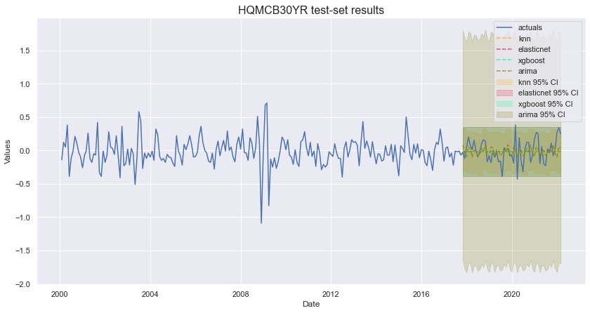
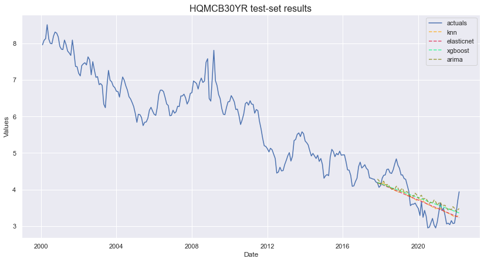
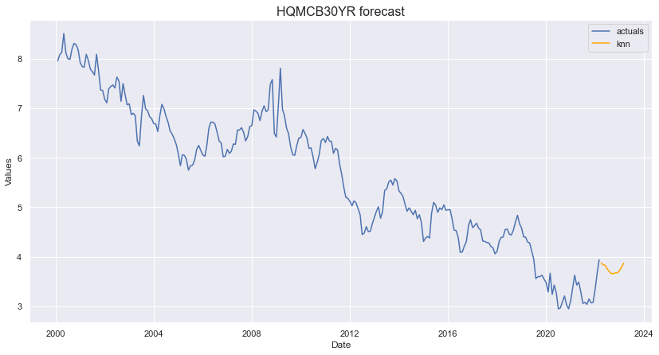
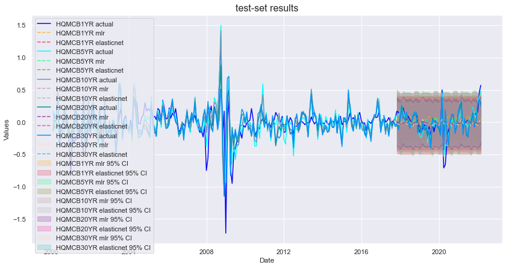
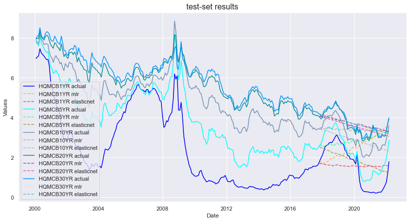
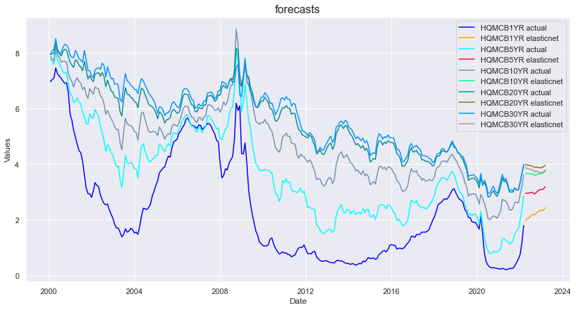
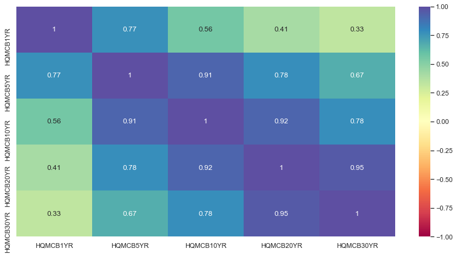
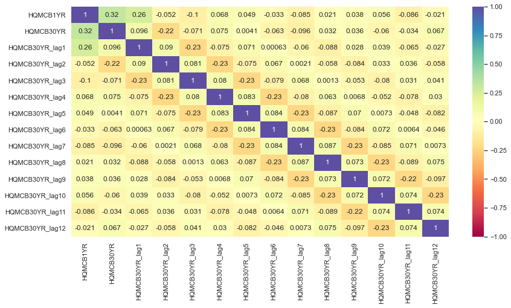

# 🌄 Scalecast: The practitioner's time series forecasting library

<p align="center">
  
</p>

## About

Scalecast is a light-weight modeling procedure and wrapper meant for those who are looking for the fastest way possible to apply, tune, and validate many different model classes for forecasting applications. In the Data Science industry, it is often asked of practitioners to deliver predictions and ranges of predictions for several lines of businesses or data slices, 100s or even 1000s. In such situations, it is common to see a simple linear regression or some other quick procedure applied to all lines due to the complexity of the task. This works well enough for people who need to deliver *something*, but more can be achieved.  

The scalecast package was designed to address this situation and offer advanced machine learning models that can be applied, optimized, and validated quickly. Unlike many libraries, the predictions produced by scalecast are always dynamic by default, not averages of one-step forecasts, so you don't run into the situation where the estimator looks great on the test-set but can't generalize to real data. What you see is what you get, with no attempt to oversell results. If you download a library that looks like it's able to predict the COVID pandemic in your test-set, you probably have a one-step forecast happening under-the-hood. You can't predict the unpredictable, and you won't see such things with scalecast.  

The library provides the `Forecaster` (for one series) and `MVForecaster` (for multiple series) wrappers around the following estimators: 

- Any regression model from [Sklearn](https://scikit-learn.org/stable/), including Sklearn APIs (like [Xgboost](https://xgboost.readthedocs.io/en/stable/) and [LightGBM](https://lightgbm.readthedocs.io/en/latest/))
- Recurrent neural nets from [Keras TensorFlow](https://keras.io/)
- Classic econometric models from [statsmodels](https://www.statsmodels.org/stable/): Holt-Winters Exponential Smoothing and ARIMA
- [Facebook Prophet](https://facebook.github.io/prophet)
- [LinkedIn Silverkite](https://engineering.linkedin.com/blog/2021/greykite--a-flexible--intuitive--and-fast-forecasting-library)
- Average, weighted average, and spliced models

## Installation
- Only the base package is needed to get started:  
`pip install scalecast`  
- Optional add-ons:  
`pip install fbprophet` (prophet model--see [here](https://stackoverflow.com/questions/49889404/fbprophet-installation-error-failed-building-wheel-for-fbprophet) to resolve a common installation issue if using Anaconda)  
`pip install greykite` (silverkite model)  
`pip install tqdm` (progress bar with notebook)  
`pip install ipython` (widgets with notebook)  
`pip install ipywidgets` (widgets with notebook)  
`jupyter nbextension enable --py widgetsnbextension` (widgets with notebook)  
`jupyter labextension install @jupyter-widgets/jupyterlab-manager` (widgets with Lab)  

## Links
|Links||
|----|----|
|[📚 Read the Docs](https://scalecast.readthedocs.io/en/latest/)|Official scalecast docs|
|[📋 Examples](https://scalecast-examples.readthedocs.io/en/latest/)|Official scalecast notebooks|
|[📓 TDS Article 1](https://towardsdatascience.com/expand-your-time-series-arsenal-with-these-models-10c807d37558)|Univariate Forecasting|
|[📓 TDS Article 2](https://towardsdatascience.com/multiple-series-forecast-them-together-with-any-sklearn-model-96319d46269)|Multivariate Forecasting|
|[🛠️ Change Log](https://scalecast.readthedocs.io/en/latest/change_log.html)|See what's changed|

## Example

Let's say we wanted to forecast each of the 1-year, 5-year, 10-year, 20-year, and 30-year corporate bond rates through the next 12 months. There are two ways we could do this with scalecast:  
1. Forecast each series individually (univariate): they will only have their own histories and any exogenous regressors we add to make forecasts. One series is predicted forward dynamically at a time.  
2. Forecast all series together (multivariate): they will have their own histories, exogenous regressors, and each other's histories to make forecasts. All series will be predicted forward dynamically at the same time.    


```python
import pandas as pd
import numpy as np
import matplotlib.pyplot as plt
import seaborn as sns
from scalecast.Forecaster import Forecaster
from scalecast.MVForecaster import MVForecaster
from scalecast import GridGenerator
from scalecast.multiseries import export_model_summaries
import pandas_datareader as pdr

sns.set(rc={'figure.figsize':(14,7)})

df = pdr.get_data_fred(
    ['HQMCB1YR','HQMCB5YR','HQMCB10YR','HQMCB20YR','HQMCB30YR'],
    start='2000-01-01',
    end='2022-03-01'
)

f_dict = {c: Forecaster(y=df[c],current_dates=df.index) for c in df}
```

    C:\Users\michaelkeith\Anaconda3\lib\site-packages\dask\dataframe\utils.py:369: FutureWarning: pandas.Int64Index is deprecated and will be removed from pandas in a future version. Use pandas.Index with the appropriate dtype instead.
      _numeric_index_types = (pd.Int64Index, pd.Float64Index, pd.UInt64Index)
    C:\Users\michaelkeith\Anaconda3\lib\site-packages\dask\dataframe\utils.py:369: FutureWarning: pandas.Float64Index is deprecated and will be removed from pandas in a future version. Use pandas.Index with the appropriate dtype instead.
      _numeric_index_types = (pd.Int64Index, pd.Float64Index, pd.UInt64Index)
    C:\Users\michaelkeith\Anaconda3\lib\site-packages\dask\dataframe\utils.py:369: FutureWarning: pandas.UInt64Index is deprecated and will be removed from pandas in a future version. Use pandas.Index with the appropriate dtype instead.
      _numeric_index_types = (pd.Int64Index, pd.Float64Index, pd.UInt64Index)
    C:\Users\michaelkeith\Anaconda3\lib\site-packages\scalecast\Forecaster.py:204: FutureWarning: The default dtype for empty Series will be 'object' instead of 'float64' in a future version. Specify a dtype explicitly to silence this warning.
      self.future_dates = pd.Series([])
    

### Option 1 - Univariate

#### Select Models


```python
models = (
    'arima',       # linear time series model
    'elasticnet',  # linear model with regularization
    'knn',         # nearest neighbor model
    'xgboost',     # boosted tree model
)
```

#### Create Grids
These grids will be used to tune each model. To get example grids, you can use:  

```python
GridGenerator.get_example_grids()
```

This saves a Grids.py file to your working directory by default, which scalecast will know how to read. This example creates its own grids:  


```python
arima_grid = dict(
    order = [(1,1,1),(0,1,1),(0,1,0)],
    seasonal_order = [(1,1,1,12),(0,1,1,12),(0,1,0,12)],
    Xvars = [None,'all']
)

elasticnet_grid = dict(
    l1_ratio = [0.25,0.5,0.75,1],
    alpha = np.linspace(0,1,100),
)

knn_grid = dict(
    n_neighbors = np.arange(2,100,2)
)

xgboost_grid = dict(
     n_estimators=[150,200,250],
     scale_pos_weight=[5,10],
     learning_rate=[0.1,0.2],
     gamma=[0,3,5],
     subsample=[0.8,0.9],
)

grid_list = [arima_grid,elasticnet_grid,knn_grid,xgboost_grid]
grids = dict(zip(models,grid_list))
```

#### Select test length, validation length, and forecast horizon


```python
def prepare_fcst(f):
    f.set_test_length(0.2)
    f.set_validation_length(12)
    f.generate_future_dates(12)
```

#### Add seasonal regressors
These are regressors like month, quarter, dayofweek, dayofyear, minute, hour, etc. Raw integer values, dummy variables, or fourier transformed variables. They are determined by the series' own histories.  


```python
def add_seasonal_regressors(f):
    f.add_seasonal_regressors('month',raw=False,sincos=True)
    f.add_seasonal_regressors('year')
    f.add_seasonal_regressors('quarter',raw=False,dummy=True,drop_first=True)
```

#### Choose Autoregressive Terms
A better way to do this would be to examine each series individually for autocorrelation. This example uses three lags for each series and one seasonal seasonal lag (assuming 12-month seasonality).


```python
def add_ar_terms(f):
    f.add_ar_terms(3)       # lags
    f.add_AR_terms((1,12))  # seasonal lags
```

#### Write the forecast procedure


```python
def tune_test_forecast(k,f,models):
    for m in models:
        print(f'forecasting {m} for {k}')
        f.set_estimator(m)
        f.ingest_grid(grids[m])
        f.tune()
        f.auto_forecast()
```

#### Run a forecast loop


```python
for k, f in f_dict.items():
    prepare_fcst(f)
    add_seasonal_regressors(f)
    add_ar_terms(f)
    f.integrate(critical_pval=0.01) # takes differences in series until they are stationary using the adf test
    tune_test_forecast(k,f,models)
```

    forecasting arima for HQMCB1YR
    forecasting elasticnet for HQMCB1YR
    forecasting knn for HQMCB1YR
    forecasting xgboost for HQMCB1YR
    forecasting arima for HQMCB5YR
    forecasting elasticnet for HQMCB5YR
    forecasting knn for HQMCB5YR
    forecasting xgboost for HQMCB5YR
    forecasting arima for HQMCB10YR
    forecasting elasticnet for HQMCB10YR
    forecasting knn for HQMCB10YR
    forecasting xgboost for HQMCB10YR
    forecasting arima for HQMCB20YR
    forecasting elasticnet for HQMCB20YR
    forecasting knn for HQMCB20YR
    forecasting xgboost for HQMCB20YR
    forecasting arima for HQMCB30YR
    forecasting elasticnet for HQMCB30YR
    forecasting knn for HQMCB30YR
    forecasting xgboost for HQMCB30YR
    

#### Visualize results
Since there are 5 series to visualize, it might be undeserible to write a plot function for each one. Instead, scalecast let's you leverage Jupyter widgets by using this function:

```python
from scalecast.notebook import results_vis
results_vis(f_dict)
```

Because we aren't able to show widgets through markdown, this readme shows a visualization for the 30-year rate only:

##### Integrated Results


```python
f.plot_test_set(ci=True,order_by='LevelTestSetMAPE')
plt.title(f'{k} test-set results',size=16)
plt.show()
```


    

    


##### Level Results


```python
f.plot_test_set(level=True,order_by='LevelTestSetMAPE')
plt.title(f'{k} test-set results',size=16)
plt.show()
```


    

    


Using level test-set MAPE, the K-nearest Neighbor model performed the best, although, as we can see, predicting bond rates accurately is difficult if not impossible. To make the forecasts look better, we can set `dynamic_testing=False` in the `manual_forecast()` or `auto_forecast()` methods when calling forecasts. This will make test-set predictions an average on one-step forecasts. By default, everything is dynamic with scalecast to give a more realistic sense of how the models perform. To see our future predictions:


```python
f.plot(level=True,models='knn')
plt.title(f'{k} forecast',size=16)
plt.show()
```


    

    


### View Results
We can print a dataframe that shows how each model did on each series.


```python
results = export_model_summaries(f_dict,determine_best_by='LevelTestSetMAPE')
results.columns
```


    Index(['ModelNickname', 'Estimator', 'Xvars', 'HyperParams', 'Scaler',
           'Observations', 'Tuned', 'DynamicallyTested', 'Integration',
           'TestSetLength', 'TestSetRMSE', 'TestSetMAPE', 'TestSetMAE',
           'TestSetR2', 'LastTestSetPrediction', 'LastTestSetActual', 'CILevel',
           'CIPlusMinus', 'InSampleRMSE', 'InSampleMAPE', 'InSampleMAE',
           'InSampleR2', 'ValidationSetLength', 'ValidationMetric',
           'ValidationMetricValue', 'models', 'weights', 'LevelTestSetRMSE',
           'LevelTestSetMAPE', 'LevelTestSetMAE', 'LevelTestSetR2', 'best_model',
           'Series'],
          dtype='object')


```python
results[['ModelNickname','Series','LevelTestSetMAPE','LevelTestSetR2','HyperParams']]
```


<div>
<style scoped>
    .dataframe tbody tr th:only-of-type {
        vertical-align: middle;
    }

    .dataframe tbody tr th {
        vertical-align: top;
    }

    .dataframe thead th {
        text-align: right;
    }
</style>
<table border="1" class="dataframe">
  <thead>
    <tr style="text-align: right;">
      <th></th>
      <th>ModelNickname</th>
      <th>Series</th>
      <th>LevelTestSetMAPE</th>
      <th>LevelTestSetR2</th>
      <th>HyperParams</th>
    </tr>
  </thead>
  <tbody>
    <tr>
      <th>0</th>
      <td>elasticnet</td>
      <td>HQMCB1YR</td>
      <td>3.178337</td>
      <td>-1.156049</td>
      <td>{'l1_ratio': 0.25, 'alpha': 0.0}</td>
    </tr>
    <tr>
      <th>1</th>
      <td>knn</td>
      <td>HQMCB1YR</td>
      <td>3.526606</td>
      <td>-1.609881</td>
      <td>{'n_neighbors': 6}</td>
    </tr>
    <tr>
      <th>2</th>
      <td>arima</td>
      <td>HQMCB1YR</td>
      <td>5.052915</td>
      <td>-4.458788</td>
      <td>{'order': (1, 1, 1), 'seasonal_order': (0, 1, ...</td>
    </tr>
    <tr>
      <th>3</th>
      <td>xgboost</td>
      <td>HQMCB1YR</td>
      <td>5.881190</td>
      <td>-6.700988</td>
      <td>{'n_estimators': 150, 'scale_pos_weight': 5, '...</td>
    </tr>
    <tr>
      <th>4</th>
      <td>xgboost</td>
      <td>HQMCB5YR</td>
      <td>0.372265</td>
      <td>0.328466</td>
      <td>{'n_estimators': 250, 'scale_pos_weight': 5, '...</td>
    </tr>
    <tr>
      <th>5</th>
      <td>knn</td>
      <td>HQMCB5YR</td>
      <td>0.521959</td>
      <td>0.119923</td>
      <td>{'n_neighbors': 26}</td>
    </tr>
    <tr>
      <th>6</th>
      <td>elasticnet</td>
      <td>HQMCB5YR</td>
      <td>0.664711</td>
      <td>-0.263214</td>
      <td>{'l1_ratio': 0.25, 'alpha': 0.0}</td>
    </tr>
    <tr>
      <th>7</th>
      <td>arima</td>
      <td>HQMCB5YR</td>
      <td>1.693632</td>
      <td>-7.335685</td>
      <td>{'order': (1, 1, 1), 'seasonal_order': (0, 1, ...</td>
    </tr>
    <tr>
      <th>8</th>
      <td>elasticnet</td>
      <td>HQMCB10YR</td>
      <td>0.145834</td>
      <td>0.390825</td>
      <td>{'l1_ratio': 0.25, 'alpha': 0.010101010101010102}</td>
    </tr>
    <tr>
      <th>9</th>
      <td>knn</td>
      <td>HQMCB10YR</td>
      <td>0.175513</td>
      <td>0.341443</td>
      <td>{'n_neighbors': 26}</td>
    </tr>
    <tr>
      <th>10</th>
      <td>xgboost</td>
      <td>HQMCB10YR</td>
      <td>0.465610</td>
      <td>-2.875923</td>
      <td>{'n_estimators': 150, 'scale_pos_weight': 5, '...</td>
    </tr>
    <tr>
      <th>11</th>
      <td>arima</td>
      <td>HQMCB10YR</td>
      <td>0.569411</td>
      <td>-4.968624</td>
      <td>{'order': (1, 1, 1), 'seasonal_order': (0, 1, ...</td>
    </tr>
    <tr>
      <th>12</th>
      <td>elasticnet</td>
      <td>HQMCB20YR</td>
      <td>0.096262</td>
      <td>0.475912</td>
      <td>{'l1_ratio': 0.25, 'alpha': 0.030303030303030304}</td>
    </tr>
    <tr>
      <th>13</th>
      <td>knn</td>
      <td>HQMCB20YR</td>
      <td>0.103565</td>
      <td>0.486593</td>
      <td>{'n_neighbors': 26}</td>
    </tr>
    <tr>
      <th>14</th>
      <td>xgboost</td>
      <td>HQMCB20YR</td>
      <td>0.105995</td>
      <td>0.441079</td>
      <td>{'n_estimators': 200, 'scale_pos_weight': 5, '...</td>
    </tr>
    <tr>
      <th>15</th>
      <td>arima</td>
      <td>HQMCB20YR</td>
      <td>0.118033</td>
      <td>0.378309</td>
      <td>{'order': (1, 1, 1), 'seasonal_order': (0, 1, ...</td>
    </tr>
    <tr>
      <th>16</th>
      <td>knn</td>
      <td>HQMCB30YR</td>
      <td>0.075318</td>
      <td>0.560975</td>
      <td>{'n_neighbors': 22}</td>
    </tr>
    <tr>
      <th>17</th>
      <td>elasticnet</td>
      <td>HQMCB30YR</td>
      <td>0.089038</td>
      <td>0.538360</td>
      <td>{'l1_ratio': 0.25, 'alpha': 0.030303030303030304}</td>
    </tr>
    <tr>
      <th>18</th>
      <td>xgboost</td>
      <td>HQMCB30YR</td>
      <td>0.098148</td>
      <td>0.495318</td>
      <td>{'n_estimators': 200, 'scale_pos_weight': 5, '...</td>
    </tr>
    <tr>
      <th>19</th>
      <td>arima</td>
      <td>HQMCB30YR</td>
      <td>0.099816</td>
      <td>0.498638</td>
      <td>{'order': (1, 1, 1), 'seasonal_order': (0, 1, ...</td>
    </tr>
  </tbody>
</table>
</div>


### Option 2: Multivariate

#### Select Models
Only sklearn models are available with multivariate forecasting, so we can replace ARIMA with mlr.


```python
mv_models = (
    'mlr',
    'elasticnet',
    'knn',
    'xgboost',
)
```

#### Create Grids
We can use three of the same grids as we did in univariate forecasting and create a new MLR grid, with a modification to also search the optimal lag numbers. The `lags` argument can be an `int`, `list`, or `dict` type and all series will use the other series' lags (as well as theirown lags) in each model that is called. Again, for mv forecasting, we can save default grids:  

```python
GridGenerator.get_mv_grids()
```

This creates the MVGrids.py file in your working directory by default, which scalecast knows how to read.  


```python
mlr_grid = dict(lags = np.arange(1,13,1))
elasticnet_grid['lags'] = np.arange(1,13,1)
knn_grid['lags'] = np.arange(1,13,1)
xgboost_grid['lags'] = np.arange(1,13,1)

mv_grid_list = [mlr_grid,elasticnet_grid,knn_grid,xgboost_grid]
mv_grids = dict(zip(mv_models,mv_grid_list))
```

### Create multivariate forecasting object
- Need to change test and validation length
- Regressors are already carried forward from the underlying `Forecaster` objects
- Integration level are also carried forward from the underlying `Forecaster` objects


```python
mvf = MVForecaster(
    *f_dict.values(),
    names = f_dict.keys()
)

mvf.set_test_length(.2)
mvf.set_validation_length(12)
mvf
```


    MVForecaster(
        DateStartActuals=2000-02-01T00:00:00.000000000
        DateEndActuals=2022-03-01T00:00:00.000000000
        Freq=MS
        N_actuals=266
        N_series=5
        SeriesNames=['HQMCB1YR', 'HQMCB5YR', 'HQMCB10YR', 'HQMCB20YR', 'HQMCB30YR']
        ForecastLength=12
        Xvars=['monthsin', 'monthcos', 'year', 'quarter_2', 'quarter_3', 'quarter_4']
        TestLength=53
        ValidationLength=12
        ValidationMetric=rmse
        ForecastsEvaluated=[]
        CILevel=0.95
        BootstrapSamples=100
        CurrentEstimator=mlr
        OptimizeOn=mean
    )


### Choose how to optimize the models when tuning hyperparameters
Default behavior is use the mean performance of each model on all series. We don't have to run the line below to keep this behavior, but we also have the option to use this code to optimize performance on one of our series over the others. A future enhancement could include a weighted average.  


```python
mvf.set_optimize_on('mean')
```

#### Write Forecasting Procedure
- Instead of grid search, we will use randomized grid search to speed up evaluation times


```python
for m in mv_models:
    print(f'forecasting {m}')
    mvf.set_estimator(m)
    mvf.ingest_grid(mv_grids[m])
    mvf.limit_grid_size(100,random_seed=20) # do this because now grids are larger and this speeds it up
    mvf.tune()
    mvf.auto_forecast()
```

    forecasting mlr
    forecasting elasticnet
    forecasting knn
    forecasting xgboost
    

### Set best model


```python
mvf.set_best_model(determine_best_by='LevelTestSetMAPE')
mvf.best_model
```


    'knn'


The elasticnet model was chosen based on its average test-set MAPE performance on all series.

#### Visualize results
Multivariate forecasting allows us to view all series and all models together. This could get jumbled, so let's just see the mlr and elasticnet results, knowing we can see the others if we want later.

##### Integrated Results


```python
mvf.plot_test_set(ci=True,models=['mlr','elasticnet'])
plt.title(f'test-set results',size=16)
plt.show()
```


    

    


##### Level Results


```python
mvf.plot_test_set(level=True,models=['mlr','elasticnet'])
plt.title(f'test-set results',size=16)
plt.show()
```


    

    


Once again, in this object, we can also set `dynamic_testing=False` in the `manual_forecast()` or `auto_forecast()` methods when calling forecasts. Let's see model forecasts into the future using the elasticent model only:


```python
mvf.plot(level=True,models='elasticnet')
plt.title(f'forecasts',size=16)
plt.show()
```


    

    


### View Results
We can print a dataframe that shows how each model did on each series.


```python
mvresults = mvf.export_model_summaries()
mvresults.columns
```


    Index(['Series', 'ModelNickname', 'Estimator', 'Xvars', 'HyperParams', 'Lags',
           'Scaler', 'Observations', 'Tuned', 'DynamicallyTested', 'Integration',
           'TestSetLength', 'TestSetRMSE', 'TestSetMAPE', 'TestSetMAE',
           'TestSetR2', 'LastTestSetPrediction', 'LastTestSetActual', 'CILevel',
           'CIPlusMinus', 'InSampleRMSE', 'InSampleMAPE', 'InSampleMAE',
           'InSampleR2', 'ValidationSetLength', 'ValidationMetric',
           'ValidationMetricValue', 'LevelTestSetRMSE', 'LevelTestSetMAPE',
           'LevelTestSetMAE', 'LevelTestSetR2', 'OptimizedOn', 'MetricOptimized',
           'best_model'],
          dtype='object')


```python
mvresults[['ModelNickname','Series','LevelTestSetMAPE','LevelTestSetR2','HyperParams','Lags']]
```


<div>
<style scoped>
    .dataframe tbody tr th:only-of-type {
        vertical-align: middle;
    }

    .dataframe tbody tr th {
        vertical-align: top;
    }

    .dataframe thead th {
        text-align: right;
    }
</style>
<table border="1" class="dataframe">
  <thead>
    <tr style="text-align: right;">
      <th></th>
      <th>ModelNickname</th>
      <th>Series</th>
      <th>LevelTestSetMAPE</th>
      <th>LevelTestSetR2</th>
      <th>HyperParams</th>
      <th>Lags</th>
    </tr>
  </thead>
  <tbody>
    <tr>
      <th>0</th>
      <td>knn</td>
      <td>HQMCB1YR</td>
      <td>1.983621</td>
      <td>-0.040337</td>
      <td>{'n_neighbors': 24}</td>
      <td>1</td>
    </tr>
    <tr>
      <th>1</th>
      <td>mlr</td>
      <td>HQMCB1YR</td>
      <td>3.793842</td>
      <td>-2.039209</td>
      <td>{}</td>
      <td>1</td>
    </tr>
    <tr>
      <th>2</th>
      <td>elasticnet</td>
      <td>HQMCB1YR</td>
      <td>3.793793</td>
      <td>-2.039144</td>
      <td>{'l1_ratio': 0.75, 'alpha': 0.0}</td>
      <td>1</td>
    </tr>
    <tr>
      <th>3</th>
      <td>xgboost</td>
      <td>HQMCB1YR</td>
      <td>2.669461</td>
      <td>-0.429998</td>
      <td>{'n_estimators': 200, 'scale_pos_weight': 10, ...</td>
      <td>4</td>
    </tr>
    <tr>
      <th>4</th>
      <td>knn</td>
      <td>HQMCB5YR</td>
      <td>0.410430</td>
      <td>0.303932</td>
      <td>{'n_neighbors': 24}</td>
      <td>1</td>
    </tr>
    <tr>
      <th>5</th>
      <td>mlr</td>
      <td>HQMCB5YR</td>
      <td>0.824692</td>
      <td>-0.856614</td>
      <td>{}</td>
      <td>1</td>
    </tr>
    <tr>
      <th>6</th>
      <td>elasticnet</td>
      <td>HQMCB5YR</td>
      <td>0.824665</td>
      <td>-0.856494</td>
      <td>{'l1_ratio': 0.75, 'alpha': 0.0}</td>
      <td>1</td>
    </tr>
    <tr>
      <th>7</th>
      <td>xgboost</td>
      <td>HQMCB5YR</td>
      <td>0.364969</td>
      <td>0.447650</td>
      <td>{'n_estimators': 200, 'scale_pos_weight': 10, ...</td>
      <td>4</td>
    </tr>
    <tr>
      <th>8</th>
      <td>knn</td>
      <td>HQMCB10YR</td>
      <td>0.138463</td>
      <td>0.378917</td>
      <td>{'n_neighbors': 24}</td>
      <td>1</td>
    </tr>
    <tr>
      <th>9</th>
      <td>mlr</td>
      <td>HQMCB10YR</td>
      <td>0.243091</td>
      <td>-0.063537</td>
      <td>{}</td>
      <td>1</td>
    </tr>
    <tr>
      <th>10</th>
      <td>elasticnet</td>
      <td>HQMCB10YR</td>
      <td>0.243075</td>
      <td>-0.063448</td>
      <td>{'l1_ratio': 0.75, 'alpha': 0.0}</td>
      <td>1</td>
    </tr>
    <tr>
      <th>11</th>
      <td>xgboost</td>
      <td>HQMCB10YR</td>
      <td>0.322004</td>
      <td>-1.299300</td>
      <td>{'n_estimators': 200, 'scale_pos_weight': 10, ...</td>
      <td>4</td>
    </tr>
    <tr>
      <th>12</th>
      <td>knn</td>
      <td>HQMCB20YR</td>
      <td>0.089113</td>
      <td>0.496357</td>
      <td>{'n_neighbors': 24}</td>
      <td>1</td>
    </tr>
    <tr>
      <th>13</th>
      <td>mlr</td>
      <td>HQMCB20YR</td>
      <td>0.107826</td>
      <td>0.438056</td>
      <td>{}</td>
      <td>1</td>
    </tr>
    <tr>
      <th>14</th>
      <td>elasticnet</td>
      <td>HQMCB20YR</td>
      <td>0.107812</td>
      <td>0.438077</td>
      <td>{'l1_ratio': 0.75, 'alpha': 0.0}</td>
      <td>1</td>
    </tr>
    <tr>
      <th>15</th>
      <td>xgboost</td>
      <td>HQMCB20YR</td>
      <td>0.162465</td>
      <td>-0.416687</td>
      <td>{'n_estimators': 200, 'scale_pos_weight': 10, ...</td>
      <td>4</td>
    </tr>
    <tr>
      <th>16</th>
      <td>knn</td>
      <td>HQMCB30YR</td>
      <td>0.085505</td>
      <td>0.562667</td>
      <td>{'n_neighbors': 24}</td>
      <td>1</td>
    </tr>
    <tr>
      <th>17</th>
      <td>mlr</td>
      <td>HQMCB30YR</td>
      <td>0.084045</td>
      <td>0.558262</td>
      <td>{}</td>
      <td>1</td>
    </tr>
    <tr>
      <th>18</th>
      <td>elasticnet</td>
      <td>HQMCB30YR</td>
      <td>0.084037</td>
      <td>0.558233</td>
      <td>{'l1_ratio': 0.75, 'alpha': 0.0}</td>
      <td>1</td>
    </tr>
    <tr>
      <th>19</th>
      <td>xgboost</td>
      <td>HQMCB30YR</td>
      <td>0.110330</td>
      <td>0.221201</td>
      <td>{'n_estimators': 200, 'scale_pos_weight': 10, ...</td>
      <td>4</td>
    </tr>
  </tbody>
</table>
</div>


## Backtest results
To test how well, on average, our models would have done across the last-10 12-month forecast horizons, we can use the `backtest()` method. It works for both the `Forecaster` and `MVForecaster` objects.


```python
mvf.backtest('elasticnet')
mvf.export_backtest_metrics('elasticnet')
```


<div>
<style scoped>
    .dataframe tbody tr th:only-of-type {
        vertical-align: middle;
    }

    .dataframe tbody tr th {
        vertical-align: top;
    }

    .dataframe thead th {
        text-align: right;
    }
</style>
<table border="1" class="dataframe">
  <thead>
    <tr style="text-align: right;">
      <th></th>
      <th></th>
      <th>iter1</th>
      <th>iter2</th>
      <th>iter3</th>
      <th>iter4</th>
      <th>iter5</th>
      <th>iter6</th>
      <th>iter7</th>
      <th>iter8</th>
      <th>iter9</th>
      <th>iter10</th>
      <th>mean</th>
    </tr>
    <tr>
      <th>series</th>
      <th>metric</th>
      <th></th>
      <th></th>
      <th></th>
      <th></th>
      <th></th>
      <th></th>
      <th></th>
      <th></th>
      <th></th>
      <th></th>
      <th></th>
    </tr>
  </thead>
  <tbody>
    <tr>
      <th rowspan="4" valign="top">HQMCB1YR</th>
      <th>RMSE</th>
      <td>0.487971</td>
      <td>0.295814</td>
      <td>0.147322</td>
      <td>0.164049</td>
      <td>0.091141</td>
      <td>0.060353</td>
      <td>0.119651</td>
      <td>0.028003</td>
      <td>0.046719</td>
      <td>0.154311</td>
      <td>0.159533</td>
    </tr>
    <tr>
      <th>MAE</th>
      <td>0.28571</td>
      <td>0.171958</td>
      <td>0.097406</td>
      <td>0.136998</td>
      <td>0.070702</td>
      <td>0.056345</td>
      <td>0.117123</td>
      <td>0.02111</td>
      <td>0.041883</td>
      <td>0.149434</td>
      <td>0.114867</td>
    </tr>
    <tr>
      <th>R2</th>
      <td>-0.074922</td>
      <td>-0.032213</td>
      <td>0.237629</td>
      <td>-1.07959</td>
      <td>-0.758305</td>
      <td>-2.192486</td>
      <td>-35.041028</td>
      <td>-0.680347</td>
      <td>-2.329534</td>
      <td>-13.099094</td>
      <td>-5.504989</td>
    </tr>
    <tr>
      <th>MAPE</th>
      <td>0.408617</td>
      <td>0.31018</td>
      <td>0.237814</td>
      <td>0.426764</td>
      <td>0.239001</td>
      <td>0.226237</td>
      <td>0.475545</td>
      <td>0.082124</td>
      <td>0.166775</td>
      <td>0.593249</td>
      <td>0.316631</td>
    </tr>
    <tr>
      <th rowspan="4" valign="top">HQMCB5YR</th>
      <th>RMSE</th>
      <td>0.570817</td>
      <td>0.65871</td>
      <td>0.604627</td>
      <td>0.644545</td>
      <td>0.537364</td>
      <td>0.410313</td>
      <td>0.401821</td>
      <td>0.458499</td>
      <td>0.408862</td>
      <td>0.273161</td>
      <td>0.496872</td>
    </tr>
    <tr>
      <th>MAE</th>
      <td>0.402543</td>
      <td>0.525583</td>
      <td>0.522105</td>
      <td>0.585369</td>
      <td>0.466181</td>
      <td>0.344805</td>
      <td>0.326988</td>
      <td>0.392991</td>
      <td>0.327104</td>
      <td>0.203996</td>
      <td>0.409767</td>
    </tr>
    <tr>
      <th>R2</th>
      <td>-0.205337</td>
      <td>-2.315526</td>
      <td>-4.08979</td>
      <td>-7.256139</td>
      <td>-5.021421</td>
      <td>-3.150129</td>
      <td>-3.676984</td>
      <td>-4.558652</td>
      <td>-3.030571</td>
      <td>-0.79983</td>
      <td>-3.410438</td>
    </tr>
    <tr>
      <th>MAPE</th>
      <td>0.213215</td>
      <td>0.316168</td>
      <td>0.353514</td>
      <td>0.43293</td>
      <td>0.355474</td>
      <td>0.274756</td>
      <td>0.269099</td>
      <td>0.342425</td>
      <td>0.28483</td>
      <td>0.178973</td>
      <td>0.302138</td>
    </tr>
    <tr>
      <th rowspan="4" valign="top">HQMCB10YR</th>
      <th>RMSE</th>
      <td>0.374449</td>
      <td>0.474401</td>
      <td>0.507182</td>
      <td>0.635606</td>
      <td>0.534922</td>
      <td>0.4349</td>
      <td>0.483086</td>
      <td>0.586451</td>
      <td>0.589008</td>
      <td>0.352687</td>
      <td>0.497269</td>
    </tr>
    <tr>
      <th>MAE</th>
      <td>0.310979</td>
      <td>0.392149</td>
      <td>0.464092</td>
      <td>0.601646</td>
      <td>0.481887</td>
      <td>0.376152</td>
      <td>0.403262</td>
      <td>0.512031</td>
      <td>0.498309</td>
      <td>0.277614</td>
      <td>0.431812</td>
    </tr>
    <tr>
      <th>R2</th>
      <td>-0.109954</td>
      <td>-3.014724</td>
      <td>-7.328628</td>
      <td>-12.560674</td>
      <td>-5.475112</td>
      <td>-2.715311</td>
      <td>-3.472925</td>
      <td>-4.833621</td>
      <td>-4.089653</td>
      <td>-0.683906</td>
      <td>-4.428451</td>
    </tr>
    <tr>
      <th>MAPE</th>
      <td>0.111612</td>
      <td>0.140797</td>
      <td>0.175868</td>
      <td>0.234974</td>
      <td>0.18859</td>
      <td>0.148315</td>
      <td>0.160139</td>
      <td>0.207382</td>
      <td>0.201964</td>
      <td>0.112856</td>
      <td>0.168250</td>
    </tr>
    <tr>
      <th rowspan="4" valign="top">HQMCB20YR</th>
      <th>RMSE</th>
      <td>0.370336</td>
      <td>0.255213</td>
      <td>0.318524</td>
      <td>0.493896</td>
      <td>0.413632</td>
      <td>0.283031</td>
      <td>0.379169</td>
      <td>0.523698</td>
      <td>0.605537</td>
      <td>0.303488</td>
      <td>0.394652</td>
    </tr>
    <tr>
      <th>MAE</th>
      <td>0.33989</td>
      <td>0.18065</td>
      <td>0.280991</td>
      <td>0.471872</td>
      <td>0.375782</td>
      <td>0.245164</td>
      <td>0.316363</td>
      <td>0.465334</td>
      <td>0.539688</td>
      <td>0.251894</td>
      <td>0.346763</td>
    </tr>
    <tr>
      <th>R2</th>
      <td>-0.556491</td>
      <td>-0.335237</td>
      <td>-2.450294</td>
      <td>-7.18817</td>
      <td>-3.561754</td>
      <td>-0.947127</td>
      <td>-2.450003</td>
      <td>-5.43214</td>
      <td>-6.657672</td>
      <td>-0.731047</td>
      <td>-3.030993</td>
    </tr>
    <tr>
      <th>MAPE</th>
      <td>0.105202</td>
      <td>0.053226</td>
      <td>0.086066</td>
      <td>0.147459</td>
      <td>0.116833</td>
      <td>0.076122</td>
      <td>0.097674</td>
      <td>0.144917</td>
      <td>0.16848</td>
      <td>0.079162</td>
      <td>0.107514</td>
    </tr>
    <tr>
      <th rowspan="4" valign="top">HQMCB30YR</th>
      <th>RMSE</th>
      <td>0.37143</td>
      <td>0.217251</td>
      <td>0.267355</td>
      <td>0.453609</td>
      <td>0.397683</td>
      <td>0.244522</td>
      <td>0.370656</td>
      <td>0.506118</td>
      <td>0.607924</td>
      <td>0.297473</td>
      <td>0.373402</td>
    </tr>
    <tr>
      <th>MAE</th>
      <td>0.34647</td>
      <td>0.176251</td>
      <td>0.223837</td>
      <td>0.431921</td>
      <td>0.360314</td>
      <td>0.206274</td>
      <td>0.31087</td>
      <td>0.450336</td>
      <td>0.546683</td>
      <td>0.252607</td>
      <td>0.330556</td>
    </tr>
    <tr>
      <th>R2</th>
      <td>-0.810715</td>
      <td>0.070295</td>
      <td>-0.935815</td>
      <td>-4.488289</td>
      <td>-2.754592</td>
      <td>-0.381914</td>
      <td>-2.206821</td>
      <td>-5.173769</td>
      <td>-7.18541</td>
      <td>-0.80564</td>
      <td>-2.467267</td>
    </tr>
    <tr>
      <th>MAPE</th>
      <td>0.106906</td>
      <td>0.053282</td>
      <td>0.066859</td>
      <td>0.131948</td>
      <td>0.109309</td>
      <td>0.062304</td>
      <td>0.093255</td>
      <td>0.135931</td>
      <td>0.165438</td>
      <td>0.076923</td>
      <td>0.100215</td>
    </tr>
  </tbody>
</table>
</div>


## Correlation Matrices
- If you want to see how correlated the series are in your `MVForecaster` object, you can use these correlation matrices  

### All Series, no lags


```python
heatmap_kwargs = dict(
    disp='heatmap',
    vmin=-1,
    vmax=1,
    annot=True,
    cmap = "Spectral",
)
mvf.corr(**heatmap_kwargs)
plt.show()
```


    

    


### Two series, with lags


```python
mvf.corr_lags(y='HQMCB1YR',x='HQMCB30YR',lags=12,**heatmap_kwargs)
plt.show()
```


    

    


```python

```
