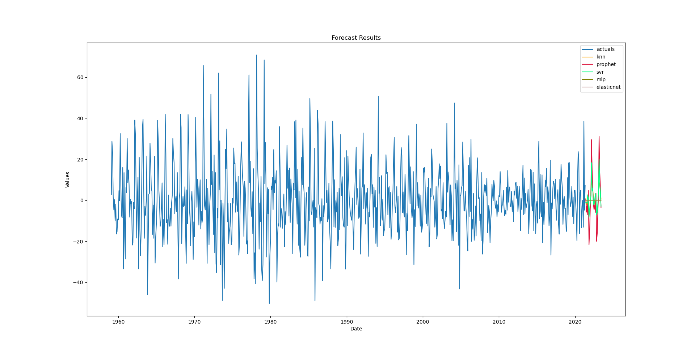
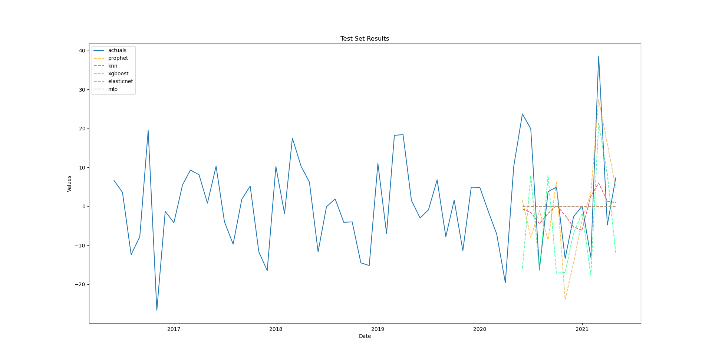
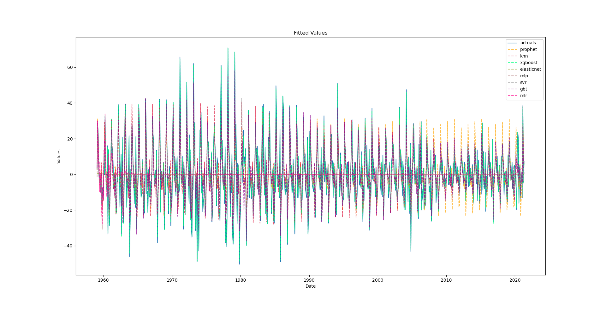
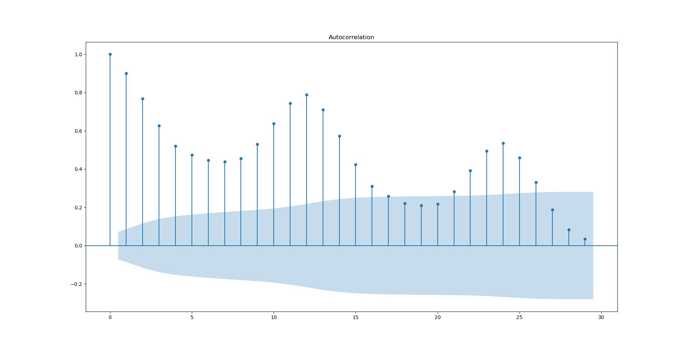
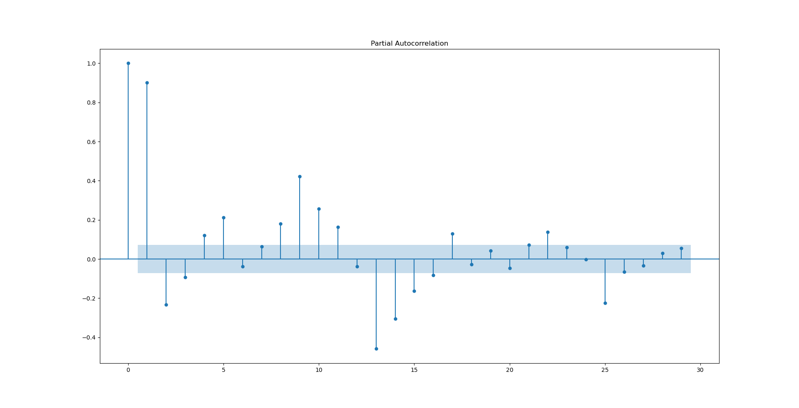
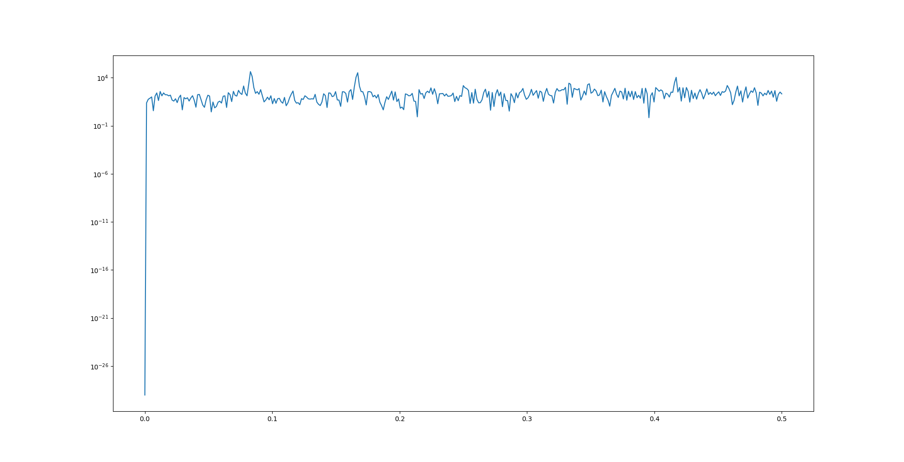
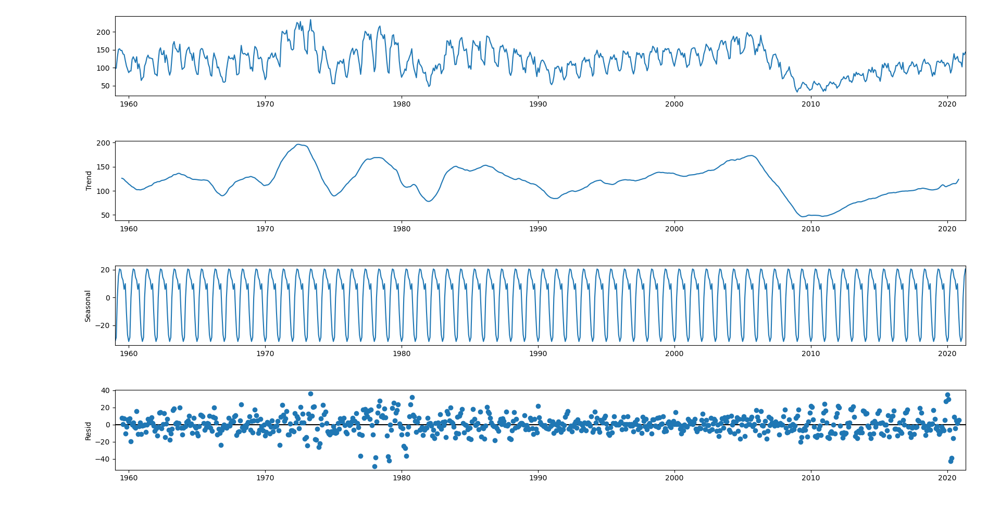
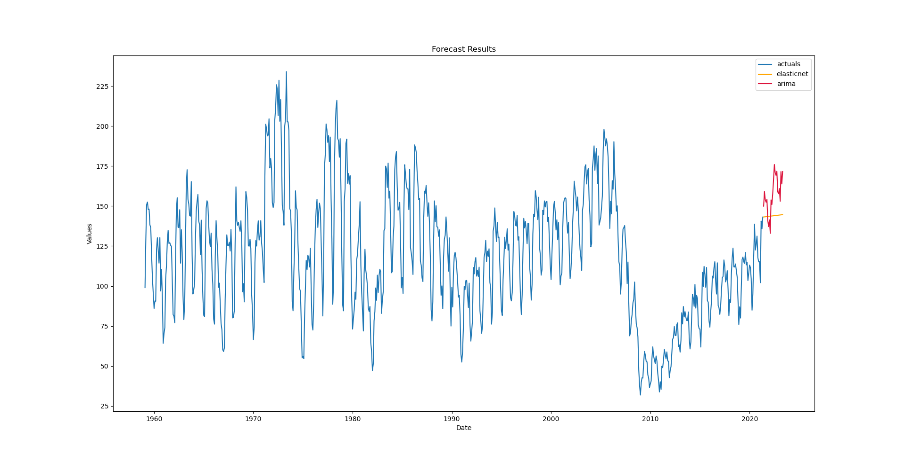

# Scalecast: Forecast everything at scale

  
  
`pip install scalecast`  

[pseudocode](#pseudocode)  
[estimators](#estimators)  
[error/accuracy metrics](#error-accuracy-metrics)  
[tuning models](#tuning-models)  
[Xvars](#xvars)  
[normalizer](#normalizer)  
[call_me](#call_me)  
[weighted average modeling](#weighted-average-modeling)  
[plotting](#plotting)  
[export](#export)  
[history](#history)  
[feature analysis](#feature-analysis)  
[forecasting the same series at different levels](#forecasting-the-same-series-at-different-levels)  
[warnings](#warnings)  
[all functions](#all-functions)  

***Support the project and help it get complete documentation on a proper website***  
*Contact: mikekeith52@gmail.com*  

- A flexible, minimal-code forecasting object meant to be used with loops to forecast many series or to focus on one series for maximum accuracy
- Flexible enough to support forecasts at different integration levels
- See [examples/housing.py](examples/housing.py) for an example of forecasting one series
- [examples/avocados.ipynb](examples/avocados.ipynb) for an example of forecasting many series
- [examples/housing_different_levels.py](examples/housing_different_levels.py) for an example of forecasting one series at different levels
- [housing_prices binder app](https://mybinder.org/v2/gh/mikekeith52/housing_prices/HEAD?filepath=housing_prices.ipynb) for an example of forecasting 5 series at 2nd differences
- All forecasting with auto-regressive terms uses an iterative process to fill in future values with forecasts so this can slow down the evaluation of many models but makes everything dynamic and reduces the chance of leakage

## pseudocode
```python
f = Forecaster(y=y_vals,current_dates=y_dates) # initialize object
f.set_test_length(test_periods) # for accuracy metrics
f.generate_future_dates(forecast_length)
f.plot(acf,pacf,periodogram,train_only=True) # EDA
f.add_regressors(autoregressive_terms) # add before differencing to lose minimal observations
f.integrate() # automatically selects 0, 1, or 2 differences using ADF test (there are also ways to be more methodical about differencing)
f.add_regressors(seasonal,combo,covid19,holidays,time_trend,polynomials,other)
f.set_validation_length(validation_periods) # to tune models, a period of time before the test set
for m in estimators:
  f.set_estimator(m)
  f.ingest_grid(dict) # can also use Grids.py to pull grids automatically with tune_test_forecast() method
  f.tune()
  f.auto_forecast() # uses best parameters from tuning process

f.set_estimator('combo') # combination modeling
f.manual_forecast(how='simple',models=[m1,m2,...],call_me='avg')
f.manual_forecast(how='weighted',models='all',determine_best_by='ValidationSetMetric',call_me='weighted') # be careful when specifying determine_best_by to not overfit/leak

f.plot(forecast,test_set,level_forecast,fitted_vals)
f.export(to_excel=True) # feature info, forecasts, test set, etc.
```

- for the examples below, pandas-datareader is necessary:
```
pip install pandas-datareader
```

## estimators

[arima](#arima)  
[combo](#combo)  
[elasticnet](#elasticnet)  
[gbt](#gbt)  
[hwes](#hwes)  
[knn](#knn)  
[lightgbm](#lightgbm)  
[mlr](#mlr)  
[mlp](#mlp)  
[prophet](#prophet)  
[rf](#rf)  
[silverkite](#silverkite)  
[svr](#svr)  
[xgboost](#xgboost)  
```python
_estimators_ = {'arima', 'mlr', 'mlp', 'gbt', 'xgboost', 'lightgbm', 'rf', 'prophet', 'silverkite', 'hwes', 'elasticnet', 'svr', 'knn', 'combo'}
```

### arima
- [Stats Models Documentation](https://www.statsmodels.org/stable/generated/statsmodels.tsa.arima.model.ARIMA.html)
- uses no Xvars by default but does accept the Xvars argument
- does not accept the normalizer argument
- can be used effectively on level or differenced data
```python
import pandas as pd
import pandas_datareader as pdr
from scalecast.Forecaster import Forecaster

df = pdr.get_data_fred('HOUSTNSA',start='1900-01-01',end='2021-05-01')
f = Forecaster(y=df['HOUSTNSA'],current_dates=df.index)
f.set_test_length(12)
f.generate_future_dates(24) # forecast length
f.set_estimator('arima')
f.manual_forecast(order=(1,1,1),seasonal_order=(2,1,0,12),trend='ct')
```

### combo
- [src](https://github.com/mikekeith52/scalecast/blob/main/src/scalecast/Forecaster.py#L484)
- three combination models are available:
  - **simple** average of specified models
  - **weighted** average of specified models
    - weights are based on `determine_best_by` parameter -- see [metrics](#error/accuracy-metrics)
  - **splice** of specified models at specified splice point(s)
    - specify splice points in `splice_points`
      - should be one less in length than models
      - models[0] --> :splice_points[0]
      - models[-1] --> splice_points[-1]:
```python
import pandas as pd
import pandas_datareader as pdr
from scalecast.Forecaster import Forecaster

df = pdr.get_data_fred('HOUSTNSA',start='1900-01-01',end='2021-05-01')
f = Forecaster(y=df['HOUSTNSA'],current_dates=df.index)
f.set_test_length(12)
f.generate_future_dates(24) # forecast length
f.set_estimator('hwes')
f.manual_forecast(trend='add',seasonal='add',call_me='hwes_add')
f.manual_forecast(trend='mul',seasonal='mul',call_me='hwes_mul')

f.set_estimator('combo')
f.manual_forecast(how='simple',models=['hwes_add','hwes_mul'],call_me='avg')
f.manual_forecast(how='weighted',determine_best_by='InSampleRMSE',models=['hwes_add','hwes_mul'],call_me='weighted') # this leaks data -- see auto_forecast for better weighted average modeling
f.manual_forecast(how='splice',models=['hwes_add','hwes_mul'],determine_best_by='InSampleRMSE',splice_points=['2022-01-01'],call_me='splice')
```
- the above weighted average model will probably overfit since `determine_best_by` is specified with an in-sample error metric that is partly calculated with the test-set
- the models argument can be a str type beginning with "top_" and that number of models will be averaged, determined by `determine_best_by`, see [export](#export)
- when using multiple models of the same estimator, be sure to use the [`call_me`](#call_me) paramater to differentiate them--otherwise, you will not be able to access all of their statistics later
```python
import pandas as pd
import pandas_datareader as pdr
from scalecast.Forecaster import Forecaster

df = pdr.get_data_fred('HOUSTNSA',start='1900-01-01',end='2021-05-01')
f = Forecaster(y=df['HOUSTNSA'],current_dates=df.index)
f.set_test_length(12)
f.generate_future_dates(24) # forecast length
f.set_estimator('hwes')
f.manual_forecast(trend='add',seasonal='add',call_me='hwes_add')
f.manual_forecast(trend='mul',seasonal='mul',call_me='hwes_mul')
f.manual_forecast(trend=None,seasonal='add',call_me='hwes_add_no_trend')

f.set_estimator('combo')
f.manual_forecast(how='simple',models='top_2',determine_best_by='InSampleRMSE',call_me='avg') # this leaks data
f.manual_forecast(how='weighted',determine_best_by='InSampleRMSE',models='top_2',call_me='weighted') # this leaks data
```
- again, both combo models in the above example include data leakage
- see [tuning models](#combo-modeling) and [weighted average modeling](#weighted-average-modeling) for a way around this problem

### elasticnet
- [Sklearn Documentation](https://scikit-learn.org/stable/modules/generated/sklearn.linear_model.ElasticNet.html)
- combines a lasso and ridge regressor
- uses all Xvars and a MinMax normalizer by default
- better on differenced data for non-stationary series
```python
import pandas as pd
import pandas_datareader as pdr
from scalecast.Forecaster import Forecaster

df = pdr.get_data_fred('HOUSTNSA',start='1900-01-01',end='2021-05-01')
f = Forecaster(y=df['HOUSTNSA'],current_dates=df.index)
f.set_test_length(12)
f.generate_future_dates(24) # forecast length
f.add_ar_terms(4)
f.add_AR_terms((2,12)) # seasonal AR terms
f.add_seasonal_regressors('month','dayofyear','week',raw=False,sincos=True)
f.add_seasonal_regressors('year')
f.add_covid19_regressor() # default is from when disney world closed to when U.S. cdc no longer recommended masks but can be changed
f.add_time_trend()
f.add_combo_regressors('t','COVID19') # multiplies time trend and COVID19 regressor
f.add_poly_terms('t') # t^2
f.diff() # non-stationary data forecasts better differenced with this model
f.set_estimator('elasticnet')
f.manual_forecast(alpha=.5,l1_ratio=.5,normalizer='scale')
```
### gbt
- [Sklearn Documentation](https://scikit-learn.org/stable/modules/generated/sklearn.ensemble.GradientBoostingRegressor.html)
- Gradient Boosted Trees
- robust to overfitting
- takes longer to run than xgboost
- uses all Xvars and a MinMax normalizer by default
- better on differenced data for non-stationary series
```python
import pandas as pd
import pandas_datareader as pdr
from scalecast.Forecaster import Forecaster

df = pdr.get_data_fred('HOUSTNSA',start='1900-01-01',end='2021-05-01')
f = Forecaster(y=df['HOUSTNSA'],current_dates=df.index)
f.set_test_length(12)
f.generate_future_dates(24) # forecast length
f.add_ar_terms(4)
f.add_AR_terms((2,12)) # seasonal AR terms
f.add_seasonal_regressors('month','dayofyear','week',raw=False,sincos=True)
f.add_seasonal_regressors('year')
f.add_covid19_regressor() # default is from when disney world closed to when U.S. cdc no longer recommended masks but can be changed
f.add_time_trend()
f.add_combo_regressors('t','COVID19') # multiplies time trend and COVID19 regressor
f.diff() # non-stationary data forecasts better differenced with this model
f.set_estimator('gbt')
f.manual_forecast(max_depth=2,normalizer=None)
```

### hwes
- [Stats Models Documentation](https://www.statsmodels.org/dev/generated/statsmodels.tsa.holtwinters.ExponentialSmoothing.html)
- Holt-Winters Exponential Smoothing
- does not accept the normalizer or Xvars argument
- usually better on level data, whether or not the series is stationary
```python
import pandas as pd
import pandas_datareader as pdr
from scalecast.Forecaster import Forecaster

df = pdr.get_data_fred('HOUSTNSA',start='1900-01-01',end='2021-05-01')
f = Forecaster(y=df['HOUSTNSA'],current_dates=df.index)
f.set_test_length(12)
f.generate_future_dates(24) # forecast length
f.set_estimator('hwes')
f.manual_forecast(trend='add',seasonal='mul')
```

### knn
- [Sklearn Documentation](https://scikit-learn.org/stable/modules/generated/sklearn.neighbors.KNeighborsRegressor.html)
- K-nearest Neighbors
- uses all Xvars and a MinMax normalizer by default
- better on differenced data for non-stationary series
```python
import pandas as pd
import pandas_datareader as pdr
from scalecast.Forecaster import Forecaster

df = pdr.get_data_fred('HOUSTNSA',start='1900-01-01',end='2021-05-01')
f = Forecaster(y=df['HOUSTNSA'],current_dates=df.index)
f.set_test_length(12)
f.generate_future_dates(24) # forecast length
f.add_ar_terms(4)
f.add_AR_terms((2,12)) # seasonal AR terms
f.add_seasonal_regressors('month','dayofyear','week',raw=False,sincos=True)
f.add_seasonal_regressors('year')
f.add_covid19_regressor() # default is from when disney world closed to when U.S. cdc no longer recommended masks but can be changed
f.add_time_trend()
f.add_combo_regressors('t','COVID19') # multiplies time trend and COVID19 regressor
f.add_poly_terms('t') # t^2
f.diff() # non-stationary data forecasts better differenced with this model
f.set_estimator('knn')
f.manual_forecast(n_neigbors=5,weights='uniform')
```
### lightgbm
- [LightGBM Documentation](https://lightgbm.readthedocs.io/en/latest/pythonapi/lightgbm.LGBMRegressor.html)
- light gradient boosted tree model
- uses all Xvars and a MinMax normalizer by default
- better on differenced data for non-stationary series  

`pip install lightgbm`  
```python
import pandas as pd
import pandas_datareader as pdr
from scalecast.Forecaster import Forecaster
df = pdr.get_data_fred('HOUSTNSA',start='1900-01-01',end='2021-05-01')
f = Forecaster(y=df['HOUSTNSA'],current_dates=df.index)
f.set_test_length(12)
f.generate_future_dates(24) # forecast length
f.add_ar_terms(4)
f.add_AR_terms((2,12)) # seasonal AR terms
f.add_seasonal_regressors('month','dayofyear','week',raw=False,sincos=True)
f.add_seasonal_regressors('year')
f.add_covid19_regressor() # default is from when disney world closed to when U.S. cdc no longer recommended masks but can be changed
f.add_time_trend()
f.add_combo_regressors('t','COVID19') # multiplies time trend and COVID19 regressor
f.diff() # non-stationary data forecasts better differenced with this model
f.set_estimator('xgboost')
f.manual_forecast(max_depth=3)
```
### mlp
- [Sklearn Documentation](https://scikit-learn.org/stable/modules/generated/sklearn.neural_network.MLPRegressor.html)
- Multi-Level Perceptron (neural network)
- uses all Xvars and a MinMax normalizer by default
- better on differenced data for non-stationary series
```python
import pandas as pd
import pandas_datareader as pdr
from scalecast.Forecaster import Forecaster

df = pdr.get_data_fred('HOUSTNSA',start='1900-01-01',end='2021-05-01')
f = Forecaster(y=df['HOUSTNSA'],current_dates=df.index)
f.set_test_length(12)
f.generate_future_dates(24) # forecast length
f.add_ar_terms(4)
f.add_AR_terms((2,12)) # seasonal AR terms
f.add_seasonal_regressors('month','dayofyear','week',raw=False,sincos=True)
f.add_seasonal_regressors('year')
f.add_covid19_regressor() # default is from when disney world closed to when U.S. cdc no longer recommended masks but can be changed
f.add_time_trend()
f.add_combo_regressors('t','COVID19') # multiplies time trend and COVID19 regressor
f.add_poly_terms('t') # t^2
f.diff() # non-stationary data forecasts better differenced with this model
f.set_estimator('mlp')
f.manual_forecast(Xvars=['monthsin','monthcos','year','t'],solver='lbfgs')
```
### mlr
- [Sklearn Documentation](https://scikit-learn.org/stable/modules/generated/sklearn.linear_model.LinearRegression.html)
- Multiple Linear Regression
- uses all Xvars and a MinMax normalizer by default
- better on differenced data for non-stationary series
```python
import pandas as pd
import pandas_datareader as pdr
from scalecast.Forecaster import Forecaster

df = pdr.get_data_fred('HOUSTNSA',start='1900-01-01',end='2021-05-01')
f = Forecaster(y=df['HOUSTNSA'],current_dates=df.index)
f.set_test_length(12)
f.generate_future_dates(24) # forecast length
f.add_ar_terms(4)
f.add_AR_terms((2,12)) # seasonal AR terms
f.add_seasonal_regressors('month','dayofyear','week',raw=False,sincos=True)
f.add_seasonal_regressors('year')
f.add_covid19_regressor() # default is from when disney world closed to when U.S. cdc no longer recommended masks but can be changed
f.add_time_trend()
f.add_combo_regressors('t','COVID19') # multiplies time trend and COVID19 regressor
f.add_poly_terms('t') # t^2
f.diff() # non-stationary data forecasts better differenced with this model
f.set_estimator('mlr')
f.manual_forecast(normalizer=None)
```
### prophet
- [Prophet Documentation](https://facebook.github.io/prophet/)
- uses no Xvars by default but does accept the Xvars argument
- does not accept the normalizer argument
- whether it performs better on differenced or level data depends on the series but it should be okay with either
```
pip install fbprophet
```
```python
import pandas as pd
import pandas_datareader as pdr
from scalecast.Forecaster import Forecaster

df = pdr.get_data_fred('HOUSTNSA',start='1900-01-01',end='2021-05-01')
f = Forecaster(y=df['HOUSTNSA'],current_dates=df.index)
f.set_test_length(12)
f.generate_future_dates(24) # forecast length
f.set_estimator('prophet')
f.manual_forecast(n_changepoints=3)
```

### rf
- [Sklearn Documentation](https://scikit-learn.org/stable/modules/generated/sklearn.ensemble.RandomForestRegressor.html)
- Random Forest
- uses all Xvars and a MinMax normalizer by default
- better on differenced data for non-stationary series
- prone to overfitting
```python
import pandas as pd
import pandas_datareader as pdr
from scalecast.Forecaster import Forecaster

df = pdr.get_data_fred('HOUSTNSA',start='1900-01-01',end='2021-05-01')
f = Forecaster(y=df['HOUSTNSA'],current_dates=df.index)
f.set_test_length(12)
f.generate_future_dates(24) # forecast length
f.add_ar_terms(4)
f.add_AR_terms((2,12)) # seasonal AR terms
f.add_seasonal_regressors('month','dayofyear','week',raw=False,sincos=True)
f.add_seasonal_regressors('year')
f.add_covid19_regressor() # default is from when disney world closed to when U.S. cdc no longer recommended masks but can be changed
f.add_time_trend()
f.add_combo_regressors('t','COVID19') # multiplies time trend and COVID19 regressor
f.diff() # non-stationary data forecasts better differenced with this model
f.set_estimator('rf')
f.manual_forecast(n_estimators=1000,max_depth=6)
```

### silverkite
- [GreyKite Documentation](https://linkedin.github.io/greykite/docs/0.1.0/html/index.html)
- uses no Xvars by default but does accept the Xvars argument
- does not accept the normalizer argument
- All `**kwargs` passed to ModelComponentsParam
  - default parameters with no Xvars should lead to good results most of the time as the library does a lot of under-the-hood optimization
- whether it performs better on differenced or level data depends on the series but it should be okay with either
```
pip install greykite
```
```python
import pandas as pd
import pandas_datareader as pdr
from scalecast.Forecaster import Forecaster

df = pdr.get_data_fred('HOUSTNSA',start='1900-01-01',end='2021-05-01')
f = Forecaster(y=df['HOUSTNSA'],current_dates=df.index)
f.set_test_length(12)
f.generate_future_dates(24) # forecast length
f.set_estimator('silverkite')
f.manual_forecast()
```
- when plotting after evaluating a silverkite forecast, you need to use an appropriate matplotlib aggregator
  - for Jupyter Notebooks:
    ```python
    matplotlib.use('nbAgg')
    %matplotlib inline    
    ```
  - for command line interface or Pycharm:
    ```python
    matplotlib.use('QT5Agg') 
    ```
  - add these lines after calling the silverkite forecast but before plotting
  - see other aggregators [here](https://matplotlib.org/stable/tutorials/introductory/usage.html)

### svr
- [Sklearn Documentation](https://scikit-learn.org/stable/modules/generated/sklearn.svm.SVR.html)
- Support Vector Regressor
- uses all Xvars and a MinMax normalizer by default
- better on differenced data for non-stationary series
```python
import pandas as pd
import pandas_datareader as pdr
from scalecast.Forecaster import Forecaster

df = pdr.get_data_fred('HOUSTNSA',start='1900-01-01',end='2021-05-01')
f = Forecaster(y=df['HOUSTNSA'],current_dates=df.index)
f.set_test_length(12)
f.generate_future_dates(24) # forecast length
f.add_ar_terms(4)
f.add_AR_terms((2,12)) # seasonal AR terms
f.add_seasonal_regressors('month','dayofyear','week',raw=False,sincos=True)
f.add_seasonal_regressors('year')
f.add_covid19_regressor() # default is from when disney world closed to when U.S. cdc no longer recommended masks but can be changed
f.add_time_trend()
f.add_combo_regressors('t','COVID19') # multiplies time trend and COVID19 regressor
f.diff() # non-stationary data forecasts better differenced with this model
f.set_estimator('svr')
f.manual_forecast(kernel='linear',gamma='scale',C=2,epsilon=0.01)
```

### xgboost
- [Xgboost Documentation](https://xgboost.readthedocs.io/en/latest/python/python_api.html#module-xgboost.sklearn)
- extreme gradient boosted tree model
- uses all Xvars and a MinMax normalizer by default
- better on differenced data for non-stationary series
- runs faster than gbt
```python
import pandas as pd
import pandas_datareader as pdr
from scalecast.Forecaster import Forecaster

df = pdr.get_data_fred('HOUSTNSA',start='1900-01-01',end='2021-05-01')
f = Forecaster(y=df['HOUSTNSA'],current_dates=df.index)
f.set_test_length(12)
f.generate_future_dates(24) # forecast length
f.add_ar_terms(4)
f.add_AR_terms((2,12)) # seasonal AR terms
f.add_seasonal_regressors('month','dayofyear','week',raw=False,sincos=True)
f.add_seasonal_regressors('year')
f.add_covid19_regressor() # default is from when disney world closed to when U.S. cdc no longer recommended masks but can be changed
f.add_time_trend()
f.add_combo_regressors('t','COVID19') # multiplies time trend and COVID19 regressor
f.diff() # non-stationary data forecasts better differenced with this model
f.set_estimator('xgboost')
f.manual_forecast(max_depth=2)
```

## error accuracy metrics
- relevant when combination modeling, plotting, and exporting
- both level and integrated metrics are available 
  - if the forecasts were performed on level data, these will be the same
  - if the series were differenced, these can offer interesting contrasts and views of accuracy
```python
_metrics_ = {'r2','rmse','mape','mae'}
_determine_best_by_ = {'TestSetRMSE','TestSetMAPE','TestSetMAE','TestSetR2','InSampleRMSE','InSampleMAPE','InSampleMAE',
                        'InSampleR2','ValidationMetricValue','LevelTestSetRMSE','LevelTestSetMAPE','LevelTestSetMAE',
                        'LevelTestSetR2',None}
```

### in-sample metrics
- `'InSampleRMSE','InSampleMAPE','InSampleMAE','InSampleR2'`
- These can be used to detect overfitting
- Should not be used for determining best models/weights when combination modeling as these also include the test set within them
- Still available for combination modeling in case you want to use them, but it should be understood that the accuracy metrics will be unreliable
- stored in the [history](#history) attribute

### out-of-sample metrics
- `'TestSetRMSE','TestSetMAPE','TestSetMAE','TestSetR2','LevelTestSetRMSE','LevelTestSetMAPE','LevelTestSetMAE','LevelTestSetR2'`
- These are good for ordering models from best to worst according to how well they predicted out-of-sample values
- Should not be used for  for determining best models/weights when combination modeling as it will lead to data leakage and overfitting
- Compare to in-sample metrics for a good sense of how well-fit the model is
- stored in the [history](#history) attribute

### validation metrics
- `'ValidationMetricValue'` is stored in the [history](#history) attribute
  - based on `'ValidationMetric'`, also stored in history
    - one of `{'r2','rmse','mape','mae'}`
- This will only be populated if you first tune the model with a grid and use the tune() method
- This metric can be used for combination modeling without data leakage/overfitting as they are derived from out-of-sample data but not included in the test-set
  - If you change the validation metric during the tuning process, this will no longer be reliable for combination modeling 

## tuning models
- all models except combination models can be tuned with a straightforward process
- `set_validation_length()` will set n periods aside before the test set chronologically to validate different model hyperparameters
- grids can be fed to the object that are dictionaries with a keyword as the key and array-like object as the value
- for each  model, there are different hyperparameters that can be tuned this way -- see the specific model's source documentation
- all combinations will be tried like any other grid, however, combinations that cannot be estimated together will be passed over to not break loops (this issue comes up frequently with hwes estimators)
- most estimators will also accept an `Xvars` and `normalizer` argument and these can be added to the grid

```python
import pandas as pd
import pandas_datareader as pdr
from scalecast.Forecaster import Forecaster

elasticnet_grid = {
  'alpha':[i/10 for i in range(1,101)],
  'l1_ratio':[0,0.25,0.5,0.75,1],
  'normalizer':['scale','minmax',None]
}

df = pdr.get_data_fred('HOUSTNSA',start='1900-01-01',end='2021-05-01')
f = Forecaster(y=df['HOUSTNSA'],current_dates=df.index)
f.set_test_length(12)
f.generate_future_dates(24) # forecast length
f.add_ar_terms(4)
f.add_AR_terms((2,12)) # seasonal AR terms
f.add_seasonal_regressors('month','dayofyear','week',raw=False,sincos=True)
f.add_seasonal_regressors('year')
f.add_covid19_regressor() # default is from when disney world closed to when U.S. cdc no longer recommended masks but can be changed
f.add_time_trend()
f.add_combo_regressors('t','COVID19') # multiplies time trend and COVID19 regressor
f.add_poly_terms('t') # t^2
f.diff() # non-stationary data forecasts better differenced with this model
f.set_validation_length(6)
f.set_estimator('elasticnet')
f.ingest_grid(elasticnet_grid)
f.tune()
f.auto_forecast()
```

### Grids.py
- instead of placing grids inside your code, you can create, copy/paste, or use [GridGenerator][#grid-generator] functions to place a file called Grids.py to store your grids in the working directory and they will be read in automatically
- you can pass the name of the grid as str to `ingest_grid()` but you can also skip straight to `tune()` and it will automatically search for a grid in Grids.py with the same name as the estimator
```python
# Grids.py
elasticnet = {
  'alpha':[i/10 for i in range(1,101)],
  'l1_ratio':[0.5],
  'normalizer':['scale','minmax',None]  
}

lasso = {
  'alpha':[i/10 for i in range(1,101)],
  'l1_ratio':[1],
  'normalizer':['scale','minmax',None]
}

ridge = {
  'alpha':[i/10 for i in range(1,101)],
  'l1_ratio':[0],
  'normalizer':['scale','minmax',None]
}

# main.py
import pandas as pd
import pandas_datareader as pdr
from scalecast.Forecaster import Forecaster

df = pdr.get_data_fred('HOUSTNSA',start='1900-01-01',end='2021-05-01')
f = Forecaster(y=df['HOUSTNSA'],current_dates=df.index)
f.set_test_length(12)
f.generate_future_dates(24) # forecast length
f.add_ar_terms(4)
f.add_AR_terms((2,12)) # seasonal AR terms
f.add_seasonal_regressors('month','dayofyear','week',raw=False,sincos=True)
f.add_seasonal_regressors('year')
f.add_covid19_regressor() # default is from when disney world closed to when U.S. cdc no longer recommended masks but can be changed
f.add_time_trend()
f.add_combo_regressors('t','COVID19') # multiplies time trend and COVID19 regressor
f.add_poly_terms('t') # t^2
f.diff() # non-stationary data forecasts better differenced with this model
f.set_validation_length(6)
f.set_estimator('elasticnet')

# GRIDS
f.tune() # automatically ingests the elasticnet grid since it is the same as the estimator
f.auto_forecast()

f.ingest_grid('lasso') # ingests the lasso grid in Grids.py
f.tune()
f.auto_forecast(call_me='lasso')

f.ingest_grid('ridge') # ingests the ridge grid in Grids.py
f.tune()
f.auto_forecast(call_me='ridge')
```
### grid generator
- you can write the Grids.py file in /examples/Grid.py to your working directory using `GridGenerator.get_example_grids()`
- you can write empty grids using `GridGenerator.get_empty_grids()`
```python
from scalecast import GridGenerator
GridGenerator.get_example_grids() # writes the Grids.py file from /examples in the working directory, to overwrite an existing grid use overwrite=True
```
### limit_grid_size()
- `Forecaster.limit_grid_size(n)`
- use to limit big grids to a smaller size of randomly kept rows
  - **n**: `int` or `float`
    - if `int`, that many of random rows will be kept
    - if `float`, must be 0 < n < 1 and that percentage of random rows will be kept
```python
import pandas as pd
import pandas_datareader as pdr
from scalecast.Forecaster import Forecaster

mlp = {
  'activation':['relu','tanh'],
  'hidden_layer_sizes':[(25,),(25,50),(25,50,25),(100,100,100),(100,100,100,100)],
  'solver':['lbfgs','adam'],
  'normalizer':['scale','minmax',None],
  'random_state':[20]
  }

df = pdr.get_data_fred('HOUSTNSA',start='1900-01-01',end='2021-05-01')
f = Forecaster(y=df['HOUSTNSA'],current_dates=df.index)
f.set_test_length(12)
f.generate_future_dates(24) # forecast length
f.add_ar_terms(4)
f.add_AR_terms((2,12)) # seasonal AR terms
f.add_seasonal_regressors('month','dayofyear','week',raw=False,sincos=True)
f.add_seasonal_regressors('year')
f.add_covid19_regressor() # default is from when disney world closed to when U.S. cdc no longer recommended masks but can be changed
f.add_time_trend()
f.add_combo_regressors('t','COVID19') # multiplies time trend and COVID19 regressor
f.add_poly_terms('t') # t^2
f.diff() # non-stationary data forecasts better differenced with this model
f.set_validation_length(6)
f.set_estimator('mlp')
f.ingest_grid(mlp)
f.limit_grid_size(10) # random 10 rows
f.ingest_grid(mlp)
f.limit_grid_size(.1) # random 10 percent
f.tune()
f.auto_forecast()
```

### combo modeling
- the only safe way to autamatically select and weight top models for the "combo" estimator is to use in conjunction with auto forecasating
- use `determine_best_by = 'ValidationMetricValue'` (its default)
```python
# Grids.py
elasticnet = {
  'alpha':[i/10 for i in range(1,101)],
  'l1_ratio':[0.5],
  'normalizer':['scale','minmax',None]  
}

lasso = {
  'alpha':[i/10 for i in range(1,101)],
  'l1_ratio':[1],
  'normalizer':['scale','minmax',None]
}

ridge = {
  'alpha':[i/10 for i in range(1,101)],
  'l1_ratio':[0],
  'normalizer':['scale','minmax',None]
}

# main.py
import pandas as pd
import pandas_datareader as pdr
from scalecast.Forecaster import Forecaster

df = pdr.get_data_fred('HOUSTNSA',start='1900-01-01',end='2021-05-01')
f = Forecaster(y=df['HOUSTNSA'],current_dates=df.index)
f.set_test_length(12)
f.generate_future_dates(24) # forecast length
f.add_ar_terms(4)
f.add_AR_terms((2,12)) # seasonal AR terms
f.add_seasonal_regressors('month','dayofyear','week',raw=False,sincos=True)
f.add_seasonal_regressors('year')
f.add_covid19_regressor() # default is from when disney world closed to when U.S. cdc no longer recommended masks but can be changed
f.add_time_trend()
f.add_combo_regressors('t','COVID19') # multiplies time trend and COVID19 regressor
f.add_poly_terms('t') # t^2
f.diff() # non-stationary data forecasts better differenced with this model
f.set_validation_length(6)
f.set_estimator('elasticnet')

# GRIDS
f.tune() # automatically ingests the elasticnet grid since it is the same as the estimator
f.auto_forecast()

f.ingest_grid('lasso') # ingests the lasso grid in Grids.py
f.tune()
f.auto_forecast(call_me='lasso')

f.ingest_grid('ridge') # ingests the ridge grid in Grids.py
f.tune()
f.auto_forecast(call_me='ridge')

# COMBO
f.set_estimator(cobmo)
f.manual_forecast(how='simple',models='top_2',call_me='avg')
f.manual_forecast(how='weighted',models='top_2',call_me='weighted')
```

### Validation metric
- you can change validation metrics to any of `'rmse','mape','mae','r2'`
```python
# Grids.py
elasticnet = {
  'alpha':[i/10 for i in range(1,101)],
  'l1_ratio':[0.5],
  'normalizer':['scale','minmax',None]  
}

lasso = {
  'alpha':[i/10 for i in range(1,101)],
  'l1_ratio':[1],
  'normalizer':['scale','minmax',None]
}

ridge = {
  'alpha':[i/10 for i in range(1,101)],
  'l1_ratio':[0],
  'normalizer':['scale','minmax',None]
}

# main.py
import pandas as pd
import pandas_datareader as pdr
from scalecast.Forecaster import Forecaster

df = pdr.get_data_fred('HOUSTNSA',start='1900-01-01',end='2021-05-01')
f = Forecaster(y=df['HOUSTNSA'],current_dates=df.index)
f.set_test_length(12)
f.generate_future_dates(24) # forecast length
f.add_ar_terms(4)
f.add_AR_terms((2,12)) # seasonal AR terms
f.add_seasonal_regressors('month','dayofyear','week',raw=False,sincos=True)
f.add_seasonal_regressors('year')
f.add_covid19_regressor() # default is from when disney world closed to when U.S. cdc no longer recommended masks but can be changed
f.add_time_trend()
f.add_combo_regressors('t','COVID19') # multiplies time trend and COVID19 regressor
f.add_poly_terms('t') # t^2
f.diff() # non-stationary data forecasts better differenced with this model
f.set_validation_length(6)
f.set_validation_metric('r2')
f.set_estimator('elasticnet')

# GRIDS
f.tune() # automatically ingests the elasticnet grid since it is the same as the estimator
f.auto_forecast()

f.ingest_grid('lasso') # ingests the lasso grid in Grids.py
f.tune()
f.auto_forecast(call_me='lasso')

f.ingest_grid('ridge') # ingests the ridge grid in Grids.py
f.tune()
f.auto_forecast(call_me='ridge')

# COMBO
f.set_estimator(cobmo)
f.manual_forecast(how='simple',models='top_2',call_me='avg')
f.manual_forecast(how='weighted',models='top_2',call_me='weighted')
```

## Xvars
- all estimators except hwes and combo accept an `Xvars` argument
- accepted arguments are an array-like of named regressors, a `str` of a single regressor name, `'all'`, or `None`
  - for estimators that require Xvars (sklearn models), `None` and `'all'` will both use all Xvars
- all regressors must be numeric type

[seasonal regressors](#seasonal-regressors)  
[ar terms](#ar-terms)  
[time trend](#time-trend)  
[combination regressors](#combination-regressors)  
[poly terms](#poly-terms)  
[covid19](#covid19)  
[ingesting a dataframe of x variables](#ingesting-a-dataframe-of-x-variables)  
[holidays/other](#other)  

### seasonal regressors
- `Forecaster.add_seasonal_regressors(*args,raw=True,sincos=False,dummy=False,drop_first=False)`
  - **args**: includes all `pandas.Series.dt` attributes ('month','day','dayofyear','week',etc.) that return `pandas.Series.astype(int)`
    - I'm not sure there exists anywhere a complete list of possible attributes, but a good place to start is [here](https://pandas.pydata.org/docs/reference/api/pandas.Series.dt.year.html)
    - only use attributes that return a series of int type
  - **raw**: `bool`, default `True`
    - by default, the output of calling this method results in Xvars added to current_xreg and future_xreg that are int (ordinal) type
    - setting raw to `False` will bypass that
    - at least one of raw, sincos, dummy must be true
  - **sincos**: `bool`, default `False`
    - this creates two wave transformations out of the pandas output and stores them in future_xreg, current_xreg
      - formula: `sin(pi*raw_output/(max(raw_output)/2))`, `cos(pi*raw_output/(max(raw_output)/2))`
    - it uses the max from the pandas output to automatically set the cycle length, so if you think this might cause problems in the analysis, using `dummy=True` is a safer bet to achieve a similar result, but it adds more total variables
  - **dummy**: `bool`, default `False`
    - changes the raw int output into dummy 0/1 variables and stores them in future_xreg, current_xreg
  - **drop_first**: `bool`, default `False`
    - whether to drop one class for dummy variables
    - ignored when `dummy=False`
```python
>>> import pandas as pd
>>> import pandas_datareader as pdr
>>> from scalecast.Forecaster import Forecaster

>>> df = pdr.get_data_fred('HOUSTNSA',start='1900-01-01',end='2021-05-01')
>>> f = Forecaster(y=df['HOUSTNSA'],current_dates=df.index)
>>> f.generate_future_dates(24) # forecast length
>>> f.add_seasonal_regressors('month',dummy=True,sincos=True)
>>> f.add_seasonal_regressors('year')
>>> print(f)
"Forecaster object with no models evaluated. Data starts at 1959-01-01 00:00:00, ends at 2021-05-01 00:00:00, loaded to forecast out 24 periods, has 16 regressors."
>>> print(f.get_regressor_names())
['month', 'monthsin', 'monthcos', 'month_1', 'month_10', 'month_11', 'month_12', 'month_2', 'month_3', 'month_4', 'month_5', 'month_6', 'month_7', 'month_8', 'month_9', 'year']
```

### ar terms
- `Forecaster.add_ar_terms(n)`
  - **n**: `int`
    - the number of ar terms to add, will add 1 to n ar terms

- `Forecast.add_AR_terms(N)`
  - **N**: `tuple([int,int])`
    - tuple shape: `(P,m)`
      - P is the number of terms to add 
      - m is the seasonal length (12 for monthly data, for example)
```python
>>> import pandas as pd
>>> import pandas_datareader as pdr
>>> from scalecast.Forecaster import Forecaster

>>> df = pdr.get_data_fred('HOUSTNSA',start='1900-01-01',end='2021-05-01')
>>> f = Forecaster(y=df['HOUSTNSA'],current_dates=df.index)
>>> f.generate_future_dates(24) # forecast length
>>> f.add_ar_terms(4)
>>> f.add_AR_terms((2,12)) # seasonal AR terms
>>> print(f)
"Forecaster object with no models evaluated. Data starts at 1959-01-01 00:00:00, ends at 2021-05-01 00:00:00, loaded to forecast out 24 periods, has 6 regressors."
>>> print(f.get_regressor_names())
['AR1', 'AR2', 'AR3', 'AR4', 'AR12', 'AR24']
```

- the beautiful part of adding auto-regressive terms in this framework is that all metrics and forecasts use an iterative process that plugs in forecasted values to future terms, making all test set and validation predictions and forecasts dynamic
- however, doing it this way means lots of loops in the evaluation process, which means some models run very slowly
- add ar/AR terms before differencing (don't worry, they will be differenced as well)
- don't begin any other regressor names you add with "AR" as it will confuse the forecasts

### time trend
- `Forecaster.add_time_trend(called='t')`
  - **called**: `str`, default `'t'`
    - what to call the resulting time trend
```python
>>> import pandas as pd
>>> import pandas_datareader as pdr
>>> from scalecast.Forecaster import Forecaster

>>> df = pdr.get_data_fred('HOUSTNSA',start='1900-01-01',end='2021-05-01')
>>> f = Forecaster(y=df['HOUSTNSA'],current_dates=df.index)
>>> f.generate_future_dates(24) # forecast length
>>> f.add_time_trend()
>>> print(f)
"Forecaster object with no models evaluated. Data starts at 1959-01-01 00:00:00, ends at 2021-05-01 00:00:00, loaded to forecast out 24 periods, has 1 regressors."
>>> print(f.get_regressor_names())
['t']
```
### combination regressors
- `Forecaster.add_combo_regressors(*args,sep='_')`
  - **args**: names of Xvars that aleady exist in the object
    - all vars in args will be multiplied together
  - **sep**: `str`, default `"_"`
    - the separator between each term in arg to create the final variable name
```python
>>> import pandas as pd
>>> import pandas_datareader as pdr
>>> from scalecast.Forecaster import Forecaster

>>> df = pdr.get_data_fred('HOUSTNSA',start='1900-01-01',end='2021-05-01')
>>> f = Forecaster(y=df['HOUSTNSA'],current_dates=df.index)
>>> f.generate_future_dates(24) # forecast length
>>> f.add_time_trend()
>>> f.add_covid19_regressor()
>>> f.add_combo_regressors('t','COVID19')
>>> print(f)
"Forecaster object with no models evaluated. Data starts at 1959-01-01 00:00:00, ends at 2021-05-01 00:00:00, loaded to forecast out 24 periods, has 3 regressors."
>>> print(f.get_regressor_names())
['t','COVID19','t_COVID19']
```
### poly terms
- `Forecaster.add_poly_terms(*args,pwr=2,sep='^')`
  - **args**: names of Xvars that aleady exist in the object
  - **pwr**: `int`, default `2`
    - the max power to add to each term in args (2 to this number will be added)
  - **sep**: `str`, default `"^"`
    - the separator between each term in arg and pwr to create the final vairable name
```python
>>> import pandas as pd
>>> import pandas_datareader as pdr
>>> from scalecast.Forecaster import Forecaster

>>> df = pdr.get_data_fred('HOUSTNSA',start='1900-01-01',end='2021-05-01')
>>> f = Forecaster(y=df['HOUSTNSA'],current_dates=df.index)
>>> f.generate_future_dates(24) # forecast length
>>> f.add_time_trend()
>>> f.add_poly_terms('t',pwr=3)
>>> print(f)
"Forecaster object with no models evaluated. Data starts at 1959-01-01 00:00:00, ends at 2021-05-01 00:00:00, loaded to forecast out 24 periods, has 3 regressors."
>>> print(f.get_regressor_names())
['t','t^2','t^3']
```
### covid19
- `Forecaster.add_covid19_regressor(called='COVID19',start=datetime.datetime(2020,3,15),end=datetime.datetime(2021,5,13))`
- adds dummy variable that is 1 during the time period that covid19 effects are present for the series, 0 otherwise
  - **called**: `str`, default `'COVID19'`
    - what to call the resulting variable
  - **start**: `str` or `datetime` object, default `datetime.datetime(2020,3,15)`
    - the start date (default is day Walt Disney World closed in the U.S.)
    - use format yyyy-mm-dd when passing strings
  - **end**: `str` or `datetime` object, default `datetime.datetime(2021,5,13)`
    - the end date (default is day the U.S. CDC dropped mask mandate/recommendation for vaccinated people)
    - use format yyyy-mm-dd when passing strings
```python
>>> import pandas as pd
>>> import pandas_datareader as pdr
>>> from scalecast.Forecaster import Forecaster

>>> df = pdr.get_data_fred('HOUSTNSA',start='1900-01-01',end='2021-05-01')
>>> f = Forecaster(y=df['HOUSTNSA'],current_dates=df.index)
>>> f.generate_future_dates(24) # forecast length
>>> f.add_covid19_regressor()
>>> print(f)
"Forecaster object with no models evaluated. Data starts at 1959-01-01 00:00:00, ends at 2021-05-01 00:00:00, loaded to forecast out 24 periods, has 1 regressors."
>>> print(f.get_regressor_names())
['COVID19']
```
### ingesting a dataframe of x variables
- `Forecaster.ingest_Xvars_df(df,date_col='Date',drop_first=False,use_future_dates=False)`
- reads all variables from a dataframe and stores them in `current_xreg` and `future_xreg`, can use future dates here instead of `generate_future_dates()`, will convert all non-numeric variables to dummies
  - **df**: pandas dataframe
    - must span the same time period as current_dates
    - if `use_future_dates = False`, must span at least the same time period as future_dates
  - **date_col**: `str`
    - the name of the date column in df
  - **drop_first**: `bool`, default `False`
    - whether to drop a class in any columns that have to be dummied
  - **use_future_dates**: `bool`, default `False`
    - whether to set the forecast periods in the object with the future dates in df
```python
>>> import pandas as pd
>>> import pandas_datareader as pdr
>>> from scalecast.Forecaster import Forecaster

>>> df = pdr.get_data_fred('HOUSTNSA',start='1970-01-01',end='2021-03-01')
>>> ur = pdr.get_data_fred('UNRATE',start='1970-01-01',end='2021-05-01').reset_index()
>>> f = Forecaster(y=df['HOUSTNSA'],current_dates=df.index)
>>> f.ingest_Xvars_df(ur,date_col='DATE',use_future_dates=True)
>>> print(f)
"Forecaster object with no models evaluated. Data starts at 1970-01-01 00:00:00, ends at 2021-03-01 00:00:00, loaded to forecast out 2 periods, has 1 regressors."
>>> print(f.get_regressor_names())
['UNRATE']
```
### other
- `Forecaster.add_other_regressor(called,start,end)`
- adds dummy variable that is 1 during the specified time period, 0 otherwise
  - **called**: `str`
    - what to call the resulting variable
  - **start**: `str` or `datetime` object
  - **end**: `str` or `datetime` object
```python
>>> import pandas as pd
>>> import pandas_datareader as pdr
>>> from scalecast.Forecaster import Forecaster

>>> df = pdr.get_data_fred('HOUSTNSA',start='1900-01-01',end='2021-05-01')
>>> f = Forecaster(y=df['HOUSTNSA'],current_dates=df.index)
>>> f.generate_future_dates(24) # forecast length
>>> f.add_other_regressor(called='Sept2001',start='2001-09-01',end='2001-09-01')
>>> print(f)
"Forecaster object with no models evaluated. Data starts at 1959-01-01 00:00:00, ends at 2021-05-01 00:00:00, loaded to forecast out 24 periods, has 1 regressors."
>>> print(f.get_regressor_names())
['Sept2001']
```
## normalizer
- `('minmax','scale',None)`
- all Sklearn and XGBOOST models have a normalizer argument that can be optimized in `tune()`
- `'minmax'`: MinMaxScaler from Sklearn
- `'scale'`: Normalizer from Sklearn

## call_me
- in `manual_forecast()` and `auto_forecast()` you can use the call_me parameter to specify the model nickname which is also the key stored in the object's [history](#history)
- by default, this will be the same as whatever the estimator is called, so if you are using one of each kind of estimator, you don't need to worry about it

### history
structure:  
```
dict(call_me = 
  dict(
    'Estimator' = str: name of estimator in `_estimators_`, always set
    'Xvars' = list: name of utilized Xvars, None when no Xvars used, always set
    'HyperParams' = dict: name/value of hyperparams, empty when all defaults, always set 
    'Scaler' = str: name of normalizer used ('minmax','scale',None), always set
    'Forecast' = list: the forecast at whatever level it was run, always set
    'FittedVals' = list: the fitted values at whatever level the forecast was run, always set
    'Tuned' = bool: whether the model was auto-tuned, always set
    'Integration' = int: the integration of the model run, 0 when no series diff taken, never greater than 2, always set
    'TestSetLength' = int: the number of periods set aside to test the model, always set
    'TestSetRMSE' = float: the RMSE of the model on the test set at whatever level the forecast was run, always set
    'TestSetMAPE' = float: the MAPE of the model on the test set at whatever level the forecast was run, `None` when there is a 0 in the actuals, always set
    'TestSetMAE' = float: the MAE of the model on the test set at whatever level the forecast was run, always set
    'TestSetR2' = float: the MAE of the model on the test set at whatever level the forecast was run, never greater than 1, can be less than 0, always set
    'TestSetPredictions' = list: the predictions on the test set, always set
    'TestSetActuals' = list: the test-set actuals, always set 
    'InSampleRMSE' = float: the RMSE of the model on the entire y series using the fitted values to compare, always set
    'InSampleMAPE' = float: the MAPE of the model on the entire y series using the fitted values to compare, `None` when there is a 0 in the actuals, always set
    'InSampleMAE' = float: the MAE of the model on the entire y series using the fitted values to compare, always set
    'InSampleR2' = float: the R2 of the model on the entire y series using the fitted values to compare, always set
    'ValidationSetLength' = int: the number of periods before the test set periods to validate the model, only set when the model has been tuned
    'ValidationMetric' = str: the name of the metric used to validate the model, only set when the model has been tuned
    'ValidationMetricValue' = float: the value of the metric used to validate the model, only set when the model has been tuned
    'univariate' = bool: True if the model uses univariate features only (hwes, prophet, arima are the only estimators where this could be True), otherwise not set
    'first_obs' = list: the first y values from the undifferenced data, only set when `diff()` has been called
    'first_dates' = list: the first date values from the undifferenced data, only set when `diff()` has been called
    'grid_evaluated' = pandas dataframe: the evaluated grid, only set when themodel has been tuned
    'models' = list: the models used in the combination, only set when the model is a 'combo' estimator
    'weights' = tuple: the weights used in the weighted average modeling, only set for weighted average combo models
    'LevelForecast' = list: the forecast in level (undifferenced terms), when data has not been differenced this is the same as 'Forecast', always set
    'LevelY' = list: the y value in level (undifferenced terms), when data has not been differenced this is the same as the y attribute, always set
    'LevelTestSetPreds' = list: the test-set predictions in level (undifferenced terms), when data has not been differenced this is the same as 'TestSetPredictions', always set
    'LevelTestSetRMSE' = float: the RMSE of the level test-set predictions vs. the level actuals, when data has not been differenced this is the same as 'TestSetRMSE', always set
    'LevelTestSetMAPE' = float: the MAPE of the level test-set predictions vs. the level actuals, when data has not been differenced this is the same as 'TestSetRMSE', None when there is a 0 in the level test-set actuals, always set
    'LevelTestSetMAE' = float: the MAE of the level test-set predictions vs. the level actuals, when data has not been differenced this is the same as 'TestSetRMSE', always set
    'LevelTestSetR2' = float: the R2 of the level test-set predictions vs. the level actuals, when data has not been differenced this is the same as 'TestSetRMSE', always set
    'LevelInSampleRMSE' = float: the RMSE of the level fitted values vs. the level actuals, when data has not been differenced this is the same as 'InSampleRMSE', always set
    'LevelInSampleMAPE' = float: the MAPE of the level fitted values vs. the level actuals, when data has not been differenced this is the same as 'InSampleRMSE', None if there is a 0 in the level actuals, always set
    'LevelInSampleMAE' = float: the MAE of the level fitted values vs. the level actuals, when data has not been differenced this is the same as 'InSampleRMSE', always set
    'LevelInSampleR2' = float: the R2 of the level fitted values vs. the level actuals, when data has not been differenced this is the same as 'InSampleRMSE', always set
    'feature_importance' = pandas dataframe: eli5 feature importance information (based on change in accuracy when a certain feature is filled with random data), only set when save_feature_importance() is called
    'summary_stats' = pandas dataframe: statsmodels summary stats information, only set when save_summary_stats() is called
  )
)
```
## weighted average modeling
- weighted averaging can easily mean data leakage and overfitting
- determining how to weigh each passed regressor should use `'ValidationMetricValue'` only if wishing to set automatically, you can also pass manually set weights
- if your manual weights do not add to one, they will be rebalanced to do so
- if they do add to one, no rebalancing anywhere will be performed
```python
>>> import pandas as pd
>>> import pandas_datareader as pdr
>>> from scalecast.Forecaster import Forecaster

>>> df = pdr.get_data_fred('HOUSTNSA',start='1900-01-01',end='2021-05-01')
>>> f = Forecaster(y=df['HOUSTNSA'],current_dates=df.index)
>>> f.set_test_length(12)
>>> f.generate_future_dates(24) # forecast length
>>> f.set_estimator('arima')
>>> f.manual_forecast(order=(1,1,1),seasonal_order=(2,1,0,12),trend='ct')
>>> f.set_estimator('hwes')
>>> f.manual_forecast(trend='mul',seasonal='add')
>>> f.set_estiamtor('combo')
>>> f.manual_forecast(how='weighted',models=['arima','hwes'],weights=(.75,.25))
>>> print(f.export('model_summaries'))
  ModelNickname Estimator Xvars  ... LevelTestSetMAE LevelTestSetR2  best_model
0         combo     combo  None  ...       29.327446      -7.696709        True
1          hwes      hwes  None  ...       38.758404     -10.243523       False
2         arima     arima  None  ...       48.316691     -21.313984       False
```
### weight rebalancing
- by default, weighted average will use a minmax or maxmin estimator depending on which metric is passed to it to determine the weights
- this means the lowest-performing model is always weighted at 0
- to make sure all models are given some weight, automatic rebalancing is performed so that .1 is added to all standardized values, then all values are rebalanced to add to 1
- this can be adjusted in the `rebalance_weights` parameter
  - the higher you set this value, the closer the weighted average becomes to a simple average, 0 means the worst model gets no weight
```python
import pandas as pd
import pandas_datareader as pdr
import matplotlib.pyplot as plt
import seaborn as sns
from scalecast.Forecaster import Forecaster

df = pdr.get_data_fred('HOUSTNSA',start='1900-01-01')
f = Forecaster(y=df['HOUSTNSA'],current_dates=df.index) # to initialize, specify y and current_dates (must be arrays of the same length)

f.set_test_length(12) # specify a test length for your models--it's a good idea to keep this the same for all forecasts
f.generate_future_dates(25) # this will create future dates that are on the same interval as the current dates and it will also set the forecast length
f.add_ar_terms(4) # add AR terms before differencing
f.add_AR_terms((2,12)) # seasonal AR terms
f.adf_test() # will print out whether it thinks the series is stationary and return a bool representing stationarity based on the augmented dickey fuller test
f.diff() # differences the y term and all ar terms to make a series stationary (also supports 2-level integration)
f.add_seasonal_regressors('month','dayofyear','week',raw=False,sincos=True) # uses pandas attributes: raw=True creates integers (default), sincos=True creates wave functions (not default), dummy=True creates dummy vars (not default)
f.add_seasonal_regressors('year')
f.add_covid19_regressor() # dates are flexible, default is from when disney world closed to when US CDC lifted mask recommendations
f.add_time_trend()
f.add_combo_regressors('t','COVID19') # multiplies regressors together
f.add_poly_terms('t',pwr=3) # by default, creates an order 2 regressor, n-order polynomial terms are allowed
f.set_validation_length(6) # length, different than test_length, to tune the hyperparameters 

# automatically tune and forecast with a series of models
models = ('mlr','knn','svr','xgboost','gbt','elasticnet','mlp','prophet')
for m in models:
  f.set_estimator(m)
  #f.ingest_grid('mlr') # manually pull any grid name that is specified in Grids.py
  f.tune() # by default, will pull the grid with the same name as the estimator (mlr will pull the mlr grid, etc.)
  f.auto_forecast()

f.set_estimator('combo')
f.manual_forecast(how='weighted',rebalance_weights=0)
```
## export
- `Forecaster.export(dfs=['all_fcsts','model_summaries','best_fcst','test_set_predictions','lvl_fcsts'],
               models='all',
               best_model='auto',
               determine_best_by='TestSetRMSE',
               to_excel=False,
               out_path='./',
               excel_name='results.xlsx')`
- exports 1-all of 5 pandas dataframes, can write to excel with each dataframe on a separate sheet, will return either a dictionary with dataframes as values or a single dataframe if only one df is specified
  - **dfs**: list-like or `str`, default `['all_fcsts','model_summaries','best_fcst','test_set_predictions','lvl_fcsts']`
    - a list or name of the specific dataframe(s) you want returned and/or written to excel
    - must be one of default
  - **models**: list-like or `str`, default `'all'`
    - the models to write information for
    - can start with "top_" and the metric specified in `determine_best_by` will be used to order the models appropriately
  - **best_model**: `str`, default `'auto'`
    - the name of the best model, if "auto", will determine this by the metric in determine_best_by
    - if not "auto", must match a model nickname of an already-evaluated model
  - **determine_best_by**: one of `_determine_best_by_`, default `'TestSetRMSE'`
  - **to_excel**: `bool`, default `False`
    - whether to save to excel
  - **out_path**: `str`, default `'./'`
    - the path to save the excel file to (ignored when `to_excel=False`)
  - **excel_name**: `str`, default `'results.xlsx'`
    - the name to call the excel file (ignored when `to_excel=False`)
```python
import pandas as pd
import pandas_datareader as pdr
import matplotlib.pyplot as plt
import seaborn as sns

from scalecast.Forecaster import Forecaster

df = pdr.get_data_fred('HOUSTNSA',start='1900-01-01')
f = Forecaster(y=df['HOUSTNSA'],current_dates=df.index) # to initialize, specify y and current_dates (must be arrays of the same length)

f.set_test_length(12) # specify a test length for your models--it's a good idea to keep this the same for all forecasts
f.generate_future_dates(25) # this will create future dates that are on the same interval as the current dates and it will also set the forecast length
f.add_ar_terms(4) # add AR terms before differencing
f.add_AR_terms((2,12)) # seasonal AR terms
f.adf_test() # will print out whether it thinks the series is stationary and return a bool representing stationarity based on the augmented dickey fuller test
f.diff() # differences the y term and all ar terms to make a series stationary (also supports 2-level integration)
f.add_seasonal_regressors('month','dayofyear','week',raw=False,sincos=True) # uses pandas attributes: raw=True creates integers (default), sincos=True creates wave functions (not default), dummy=True creates dummy vars (not default)
f.add_seasonal_regressors('year')
f.add_covid19_regressor() # dates are flexible, default is from when disney world closed to when US CDC lifted mask recommendations
f.add_time_trend()
f.add_combo_regressors('t','COVID19') # multiplies regressors together
f.add_poly_terms('t',pwr=3) # by default, creates an order 2 regressor, n-order polynomial terms are allowed
f.set_validation_length(6) # length, different than test_length, to tune the hyperparameters 

# automatically tune and forecast with a series of models
models = ('mlr','knn','svr','xgboost','gbt','elasticnet','mlp','prophet')
for m in models:
  f.set_estimator(m)
  #f.ingest_grid('mlr') # manually pull any grid name that is specified in Grids.py
  f.tune() # by default, will pull the grid with the same name as the estimator (mlr will pull the mlr grid, etc.)
  f.auto_forecast()

f.export(to_excel=True,excel_name='all_results.xlsx') # will write all five dataframes as separate sheets to excel in the local directory as "all_results.xlsx"
```
- see [examples/housing_results](examples/housing_results.xlsx) for an example of all 5 dataframes
- see [examples/avocado_model_summaries.csv](examples/avocado_model_summaries.csv) for an example of the `'model_summaries'` dataframe concatenated from the run of many series

## plotting

[plot](#plot)  
[plot_test_set](#plot_test_set)  
[plot_fitted](#plot_fitted)  
[plot_acf](#plot_acf)  
[plot_pacf](#plot_pacf)  
[plot_periodogram](#plot_periodogram)  
[seasonal_decompose](#seasonal_decompose)  

### plot

- `Forecaster.plot(models='all',order_by=None,level=False,print_attr=[])`
  - **models**: list-like or `str`, default `'all'`
    - the models to plot
    - can start with `"top_"` and the metric specified in `order_by` will be used to order the models appropriately
  - **order_by**: one of `_determine_best_by_`, default `None`
  - **level**: `bool`, default `False`
    - if `True`, will always plot level forecasts
    - if `False`, will plot the forecasts at whatever level they were called on
    - if `False` and there are a mix of models passed with different integrations, will default to `True`
  - **print_attr**: list-like, default `[]`
    - attributes from history dict to print to console
    - if the attribute doesn't exist for a passed model, will not raise error, will just skip that element
```python
>>> import pandas as pd
>>> import pandas_datareader as pdr
>>> import matplotlib.pyplot as plt
>>> import seaborn as sns

>>> from scalecast.Forecaster import Forecaster

>>> df = pdr.get_data_fred('HOUSTNSA',start='1900-01-01')
>>> f = Forecaster(y=df['HOUSTNSA'],current_dates=df.index) # to initialize, specify y and current_dates (must be arrays of the same length)

>>> f.set_test_length(12) # specify a test length for your models--it's a good idea to keep this the same for all forecasts
>>> f.generate_future_dates(25) # this will create future dates that are on the same interval as the current dates and it will also set the forecast length
>>> f.add_ar_terms(4) # add AR terms before differencing
>>> f.add_AR_terms((2,12)) # seasonal AR terms
>>> f.adf_test() # will print out whether it thinks the series is stationary and return a bool representing stationarity based on the augmented dickey fuller test
>>> f.diff() # differences the y term and all ar terms to make a series stationary (also supports 2-level integration)
>>> f.add_seasonal_regressors('month','dayofyear','week',raw=False,sincos=True) # uses pandas attributes: raw=True creates integers (default), sincos=True creates wave functions (not default), dummy=True creates dummy vars (not default)
>>> f.add_seasonal_regressors('year')
>>> f.add_covid19_regressor() # dates are flexible, default is from when disney world closed to when US CDC lifted mask recommendations
>>> f.add_time_trend()
>>> f.add_combo_regressors('t','COVID19') # multiplies regressors together
>>> f.add_poly_terms('t',pwr=3) # by default, creates an order 2 regressor, n-order polynomial terms are allowed
>>> f.set_validation_length(6) # length, different than test_length, to tune the hyperparameters 

>>> # automatically tune and forecast with a series of models
>>> models = ('mlr','knn','svr','xgboost','gbt','elasticnet','mlp','prophet')
>>> for m in models:
>>>   f.set_estimator(m)
>>>   #f.ingest_grid('mlr') # manually pull any grid name that is specified in Grids.py
>>>   f.tune() # by default, will pull the grid with the same name as the estimator (mlr will pull the mlr grid, etc.)
>>>   f.auto_forecast()

>>> f.plot(models='top_5',order_by='LevelTestSetMAPE',print_attr=['TestSetRMSE','HyperParams','Xvars']) # plots the forecast differences or levels based on the level the forecast was performed on
knn TestSetRMSE: 15.270860125581308
knn HyperParams: {'n_neighbors': 19, 'weights': 'uniform'}
knn Xvars: ['AR1', 'AR2', 'AR3', 'AR4', 'AR12', 'AR24', 'monthsin', 'monthcos', 'dayofyearsin', 'dayofyearcos', 'weeksin', 'weekcos', 'year', 'COVID19', 't', 't_COVID19', 't^2', 't^3']
prophet TestSetRMSE: 15.136371374950649
prophet HyperParams: {'n_changepoints': 2}
prophet Xvars: None
svr TestSetRMSE: 16.67679416471487
svr HyperParams: {'kernel': 'poly', 'degree': 2, 'gamma': 'scale', 'C': 3.0, 'epsilon': 0.1}
svr Xvars: ['AR1', 'AR2', 'AR3', 'AR4', 'AR12', 'AR24', 'monthsin', 'monthcos', 'dayofyearsin', 'dayofyearcos', 'weeksin', 'weekcos', 'year', 'COVID19', 't', 't_COVID19', 't^2', 't^3']
mlp TestSetRMSE: 16.27657072564657
mlp HyperParams: {'activation': 'tanh', 'hidden_layer_sizes': (25, 25), 'solver': 'lbfgs', 'random_state': 20}
mlp Xvars: ['AR1', 'AR2', 'AR3', 'AR4', 'AR12', 'AR24', 'monthsin', 'monthcos', 'dayofyearsin', 'dayofyearcos', 'weeksin', 'weekcos', 'year', 'COVID19', 't', 't_COVID19', 't^2', 't^3']
elasticnet TestSetRMSE: 16.269472253462983
elasticnet HyperParams: {'alpha': 0.1, 'l1_ratio': 0.0}
elasticnet Xvars: ['AR1', 'AR2', 'AR3', 'AR4', 'AR12', 'AR24', 'monthsin', 'monthcos', 'dayofyearsin', 'dayofyearcos', 'weeksin', 'weekcos', 'year', 'COVID19', 't', 't_COVID19', 't^2', 't^3']
```


### plot_test_set

- `Forecaster.plot_test_set(models='all',order_by=None,include_train=True,level=False)`
  - **models**: list-like or `str`, default `'all'`
    - the models to plot
    - can start with `"top_"` and the metric specified in `order_by` will be used to order the models appropriately
  - **order_by**: one of `_determine_best_by_`, default `None`
  - **include_train**: `bool` or `int`, default `True`
    - use to zoom into training results
    - if `True`, plots the test results with the entire history in `y`
    - if `False`, matches `y` history to test results and only plots this
    - if `int`, plots that length of `y` to match to test results
  - **level**: `bool`, default `False`
    - if `True`, will always plot level forecasts
    - if `False`, will plot the forecasts at whatever level they were called on
    - if `False` and there are a mix of models passed with different integrations, will default to `True`
```python
import pandas as pd
import pandas_datareader as pdr
import matplotlib.pyplot as plt
import seaborn as sns

from scalecast.Forecaster import Forecaster

df = pdr.get_data_fred('HOUSTNSA',start='1900-01-01')
f = Forecaster(y=df['HOUSTNSA'],current_dates=df.index) # to initialize, specify y and current_dates (must be arrays of the same length)

f.set_test_length(12) # specify a test length for your models--it's a good idea to keep this the same for all forecasts
f.generate_future_dates(25) # this will create future dates that are on the same interval as the current dates and it will also set the forecast length
f.add_ar_terms(4) # add AR terms before differencing
f.add_AR_terms((2,12)) # seasonal AR terms
f.adf_test() # will print out whether it thinks the series is stationary and return a bool representing stationarity based on the augmented dickey fuller test
f.diff() # differences the y term and all ar terms to make a series stationary (also supports 2-level integration)
f.add_seasonal_regressors('month','dayofyear','week',raw=False,sincos=True) # uses pandas attributes: raw=True creates integers (default), sincos=True creates wave functions (not default), dummy=True creates dummy vars (not default)
f.add_seasonal_regressors('year')
f.add_covid19_regressor() # dates are flexible, default is from when disney world closed to when US CDC lifted mask recommendations
f.add_time_trend()
f.add_combo_regressors('t','COVID19') # multiplies regressors together
f.add_poly_terms('t',pwr=3) # by default, creates an order 2 regressor, n-order polynomial terms are allowed
f.set_validation_length(6) # length, different than test_length, to tune the hyperparameters 

# automatically tune and forecast with a series of models
models = ('mlr','knn','svr','xgboost','gbt','elasticnet','mlp','prophet')
for m in models:
  f.set_estimator(m)
  #f.ingest_grid('mlr') # manually pull any grid name that is specified in Grids.py
  f.tune() # by default, will pull the grid with the same name as the estimator (mlr will pull the mlr grid, etc.)
  f.auto_forecast()

# combine models and run manually specified models of other varieties
f.set_estimator('combo')
f.manual_forecast(how='simple',models='top_3',determine_best_by='ValidationMetricValue',call_me='avg') # simple average of top_3 models based on performance in validation
f.manual_forecast(how='weighted',models=models,determine_best_by='ValidationMetricValue',call_me='weighted') # weighted average of all models based on metric specified in determine_best_by (default is the validation metric)

f.plot_test_set(models='top_5',order_by='TestSetR2',include_train=60) # see test-set performance visually of top 5 best models by r2 (last 60 obs only)
```


### plot_fitted

- `Forecaster.plot_fitted(models='all',order_by=None)`
  - **models**: list-like or `str`, default `'all'`
    - the models to plot
    - can start with `"top_"` and the metric specified in `order_by` will be used to order the models appropriately
  - **order_by**: one of `_determine_best_by_`, default `None`
```python
import pandas as pd
import pandas_datareader as pdr
import matplotlib.pyplot as plt
import seaborn as sns

from scalecast.Forecaster import Forecaster

df = pdr.get_data_fred('HOUSTNSA',start='1900-01-01')
f = Forecaster(y=df['HOUSTNSA'],current_dates=df.index) # to initialize, specify y and current_dates (must be arrays of the same length)

f.set_test_length(12) # specify a test length for your models--it's a good idea to keep this the same for all forecasts
f.generate_future_dates(25) # this will create future dates that are on the same interval as the current dates and it will also set the forecast length
f.add_ar_terms(4) # add AR terms before differencing
f.add_AR_terms((2,12)) # seasonal AR terms
f.adf_test() # will print out whether it thinks the series is stationary and return a bool representing stationarity based on the augmented dickey fuller test
f.diff() # differences the y term and all ar terms to make a series stationary (also supports 2-level integration)
f.add_seasonal_regressors('month','dayofyear','week',raw=False,sincos=True) # uses pandas attributes: raw=True creates integers (default), sincos=True creates wave functions (not default), dummy=True creates dummy vars (not default)
f.add_seasonal_regressors('year')
f.add_covid19_regressor() # dates are flexible, default is from when disney world closed to when US CDC lifted mask recommendations
f.add_time_trend()
f.add_combo_regressors('t','COVID19') # multiplies regressors together
f.add_poly_terms('t',pwr=3) # by default, creates an order 2 regressor, n-order polynomial terms are allowed
f.set_validation_length(6) # length, different than test_length, to tune the hyperparameters 

# automatically tune and forecast with a series of models
models = ('mlr','knn','svr','xgboost','gbt','elasticnet','mlp','prophet')
for m in models:
  f.set_estimator(m)
  #f.ingest_grid('mlr') # manually pull any grid name that is specified in Grids.py
  f.tune() # by default, will pull the grid with the same name as the estimator (mlr will pull the mlr grid, etc.)
  f.auto_forecast()

# combine models and run manually specified models of other varieties
f.set_estimator('combo')
f.manual_forecast(how='simple',models='top_3',determine_best_by='ValidationMetricValue',call_me='avg') # simple average of top_3 models based on performance in validation
f.manual_forecast(how='weighted',models=models,determine_best_by='ValidationMetricValue',call_me='weighted') # weighted average of all models based on metric specified in determine_best_by (default is the validation metric)

f.plot_fitted(order_by='TestSetR2') # plot fitted values of all models ordered by r2
```


### plot_acf

- `Forecaster.plot_acf(diffy=False,train_only=False,**kwargs)`
  - `plot_acf()` from `statsmodels`
  - **diffy**: `bool` or `int`, default `False `
    - if bool, whether to call the function on the first differenced `y` series
    - if int, will use that many differences in y before passing to plot function
  - **train_only**: `bool`, default `False`
    - whether to plot only training data (new in 0.2.6 to reduce data leakage chances)
  - `**kwargs` passed to the sm function
```python
import pandas as pd
import pandas_datareader as pdr
import matplotlib.pyplot as plt
import seaborn as sns

from scalecast.Forecaster import Forecaster

df = pdr.get_data_fred('HOUSTNSA',start='1900-01-01')
f = Forecaster(y=df['HOUSTNSA'],current_dates=df.index) # to initialize, specify y and current_dates (must be arrays of the same length)
f.set_test_length(12)

# time series exploration
f.plot_acf(train_only=True)
plt.show()
```


### plot_pacf

- `Forecaster.plot_pacf(diffy=False,train_only=False,**kwargs)`
  - `plot_pacf()` from `statsmodels`
  - **diffy**: `bool` or `int`, default `False `
    - if bool, whether to call the function on the first differenced `y` series
    - if int, will use that many differences in y before passing to plot function
  - **train_only**: `bool`, default `False`
    - whether to plot only training data (new in 0.2.6 to reduce data leakage chances)
  - `**kwargs` passed to the sm function
```python
import pandas as pd
import pandas_datareader as pdr
import matplotlib.pyplot as plt
import seaborn as sns

from scalecast.Forecaster import Forecaster

df = pdr.get_data_fred('HOUSTNSA',start='1900-01-01')
f = Forecaster(y=df['HOUSTNSA'],current_dates=df.index) # to initialize, specify y and current_dates (must be arrays of the same length)
f.set_test_length(12)

# time series exploration
f.plot_pacf(diffy=True,train_only=True)
plt.show()
```


### plot_periodogram

- `Forecaster.plot_periodogram(diffy=False,train_only=False)`
  - `periodogram()` from `scipy`
  - **diffy**: `bool` or `int`, default `False `
    - if bool, whether to call the function on the first differenced `y` series
    - if int, will use that many differences in y before passing to plot function
  - **train_only**: `bool`, default `False`
    - whether to plot only training data (new in 0.2.6 to reduce data leakage chances)
```python
import pandas as pd
import pandas_datareader as pdr
import matplotlib.pyplot as plt
import seaborn as sns

from scalecast.Forecaster import Forecaster

df = pdr.get_data_fred('HOUSTNSA',start='1900-01-01')
f = Forecaster(y=df['HOUSTNSA'],current_dates=df.index) # to initialize, specify y and current_dates (must be arrays of the same length)
f.set_test_length(12)

a, b = f.plot_periodogram(diffy=True,train_only=True)
plt.semilogy(a, b)
plt.show()
```


### seasonal_decompose

- `Forecaster.seasonal_decompose(diffy=False,train_only=False,**kwargs)`
  - `seasonal_decompose()` from `statsmodels`
  - **diffy**: `bool` or `int`, default `False `
    - if bool, whether to call the function on the first differenced `y` series
    - if int, will use that many differences in y before passing to plot function
  - **train_only**: `bool`, default `False`
    - whether to plot only training data (new in 0.2.6 to reduce data leakage chances)
  - `**kwargs` passed to the sm function
```python
import pandas as pd
import pandas_datareader as pdr
import matplotlib.pyplot as plt
import seaborn as sns

from scalecast.Forecaster import Forecaster

df = pdr.get_data_fred('HOUSTNSA',start='1900-01-01')
f = Forecaster(y=df['HOUSTNSA'],current_dates=df.index) # to initialize, specify y and current_dates (must be arrays of the same length)
f.set_test_length(12)

f.seasonal_decompose(train_only=True).plot()
plt.show()
```


## history
see [call_me](#history)

## feature analysis
- the following models have `eli5` feature importance attributes that can be saved to the history as dataframes
  - `'mlr', 'mlp', 'gbt', 'xgboost', 'rf', 'elasticnet', 'svr', 'knn', 'lightgbm'`
- the following models have summary stats:
  - `'arima', 'hwes', 'silverkite'`
- you can save these to history (run right after a forecast is created):
  - `Forecaster.save_feature_importance()`
  - `Forecaster.save_summary_stats()`
    - does not raise error if the last model run does not support feature importance/summary stats so that it won't break loops
  - `Forecaster.export_feature_importance(model)`
  - `Forecaster.export_summary_stats(model)`
    - model should match what is passed to [call_me](#call_me)

## forecasting the same series at different levels
- you can use `undiff()` to revert back to the series' original integration
  - will delete all regressors so you will have to re-add the ones you want
- when differencing, `diff(1)` is default but `diff(2)` is also supported
- do not combine forecasts (`'combo'` estimator) run at different levels -- will return nonsense
- `plot()` and `plot_test_set()` default to level unless you only call models run at one integration or another
- `plot_fitted()` cannot mix models with different integrations
```python
import pandas as pd
import pandas_datareader as pdr
from scalecast.Forecaster import Forecaster

df = pdr.get_data_fred('HOUSTNSA',start='1900-01-01',end='2021-05-01')
f = Forecaster(y=df['HOUSTNSA'],current_dates=df.index)
f.set_test_length(12)
f.generate_future_dates(24) # forecast length
f.add_ar_terms(4)
f.add_AR_terms((2,12)) # seasonal AR terms
f.add_seasonal_regressors('month','dayofyear','week',raw=False,sincos=True)
f.add_seasonal_regressors('year')
f.add_covid19_regressor() # default is from when disney world closed to when U.S. cdc no longer recommended masks but can be changed
f.add_time_trend()
f.add_combo_regressors('t','COVID19') # multiplies time trend and COVID19 regressor
f.add_poly_terms('t') # t^2
f.diff() # non-stationary data forecasts better differenced with this model
f.set_estimator('elasticnet')
f.manual_forecast(alpha=.5,l1_ratio=.5,normalizer='scale')

f.undiff() # drops all added regressors

f.set_estimator('arima')
f.manual_forecast(order=(1,1,1),seasonal_order=(2,1,0,12),trend='ct')

f.plot()
```


## warnings
- in the process of specifying so many models, you may write code that returns warnings
- rather than printing to console, these warnings are written to a log file that gets overwritten with every run

## all functions
- there's a lot more you can do with this object, see below for a list of all functions
- brief descriptions given for functions not explained anywhere else
```python
Forecaster.add_AR_terms(N)
Forecaster.add_ar_terms(n)
Forecaster.add_combo_regressors(*args, sep='_')
Forecaster.add_covid19_regressor(called='COVID19', start=datetime.datetime(2020, 3, 15, 0, 0), end=datetime.datetime(2021, 5, 13, 0, 0))
Forecaster.add_other_regressor(called, start, end)
Forecaster.add_poly_terms(*args, pwr=2, sep='^')
Forecaster.add_seasonal_regressors(*args, raw=True, sincos=False, dummy=False, drop_first=False)
Forecaster.add_time_trend(called='t')
Forecaster.adf_test(critical_pval=0.05, quiet=True, full_res=False, train_only=False, **kwargs)
  # from statsmodels: Augmented Dickey Fuller stationarity test, returns False if result is series is not stationary, True otherwise, full_res=True means the full output from sm will be returned, **kwargs passed to the statsmodel function
Forecaster.all_feature_info_to_excel(out_path='./', excel_name='feature_info.xlsx')
  # puts all saved feature importance and summary stats to Excel on separate tabs for each model where such info is available
Forecaster.all_validation_grids_to_excel(out_path='./', excel_name='validation_grids.xlsx')
  # puts all validation grids from tuned models to Excel on separate tabs for each tuned model
Forecaster.auto_forecast(call_me=None)
Forecaster.diff(i=1)
  # supports i = 1 | i = 2
Forecaster.drop_regressors(*args)
  # deletes regressors out of future xreg and current xreg
Forecaster.export(dfs=['all_fcsts', 'model_summaries', 'best_fcst', 'test_set_predictions', 'lvl_fcsts'], models='all', best_model='auto', determine_best_by='TestSetRMSE', to_excel=False, out_path='./', excel_name='results.xlsx')
Forecaster.export_feature_importance(model)
Forecaster.export_summary_stats(model)
Forecaster.export_Xvars_df()
  # exports all dates and Xvars to a pandas dataframe
Forecaster.export_validation_grid(model)
  # creates a pandas dataframe out of a validation grid for a given model with error/accuracy results saved to a column
Forecaster.fillna_y(how='ffill')
  # 'how' matches 'method' keyword from the pandas.DataFrame.fillna() method
Forecaster.generate_future_dates(n)
Forecaster.get_freq()
  # returns the freq attribute which is set from infer_freq() which matches the pandas function
Forecaster.get_regressor_names()
  # returns a list of the regressors saved to the object's names
Forecaster.infer_freq()
  # pandas.infer_freq()
Forecaster.ingest_Xvars_df(df, date_col='Date', drop_first=False, use_future_dates=False)
Forecaster.ingest_grid(grid)
Forecaster.integrate(critical_pval=0.05, train_only=False)
  # uses the Augmented Dickey Fuller test to difference data 0, 1, or 2 times
Forecaster.keep_smaller_history(n)
  # reduces the amount of y observations, n can be a str in yyyy-mm-dd, and int representing the last number of obs to keep, or a datetime/pandas date object
Forecaster.limit_grid_size(n)
Forecaster.manual_forecast(call_me=None, **kwargs)
Forecaster.order_fcsts(models, determine_best_by='TestSetRMSE')
  # returns a list of model names (matching call_me) in order from best to worst according to the determine_best_by arg
Forecaster.plot(models='all', order_by=None, level=False, print_attr=[])
Forecaster.plot_acf(diffy=False, train_only=False, **kwargs)
Forecaster.plot_fitted(models='all', order_by=None)
Forecaster.plot_pacf(diffy=False, train_only=False, **kwargs)
Forecaster.plot_periodogram(diffy=False, train_only=False)
Forecaster.plot_test_set(models='all', order_by=None, include_train=True, level=False)
Forecaster.pop(*args)
  # *args are names of models (matching call_me) that will be deleted from history
Forecaster.save_feature_importance(quiet=True)
Forecaster.save_summary_stats(quiet=True)
Forecaster.seasonal_decompose(diffy=False, **kwargs)
Forecaster.set_estimator(estimator)
Forecaster.set_last_future_date(date)
  # another way to fill future dates by stopping at the last date you want forecasted
Forecaster.set_test_length(n=1)
Forecaster.set_validation_length(n=1)
Forecaster.set_validation_metric(metric='rmse')
  # one of 'rmse','mape','mae','r2'
Forecaster.tune()
Forecaster.tune_test_forecast(models, feature_importance=False, summary_stats=False)
  # loops through all models in models, tunes using Grids.py, and can set feature_importance/summary_stats
Forecaster.typ_set()
  # sets data types of y, current_dates, etc. appropriately
Forecaster.undiff(suppress_error=False)
Forecaster.validate_regressor_names()
  # validates that all variable names in current_xreg and future_xreg match
GridGenerator.get_example_grids(overwrite=False)
GridGenerator.get_empty_grids(overwrite=False)
```
