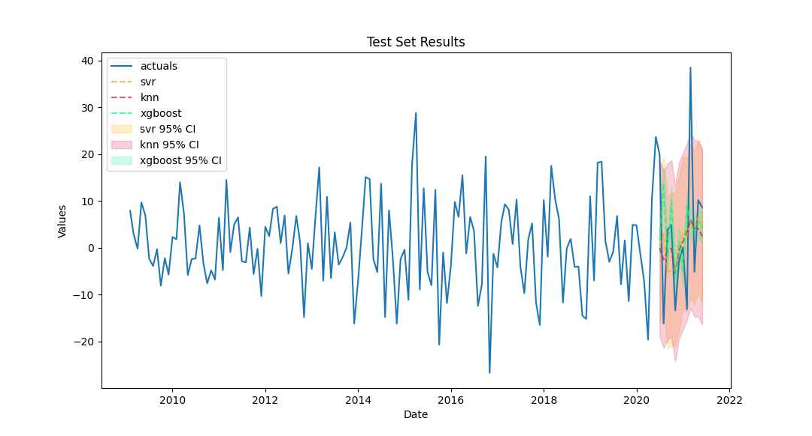

# 🌄 Scalecast: Dynamic Forecasting at Scale

<p align="center">
  
</p>

## About

This package uses a scaleable forecasting approach in Python with [scikit-learn](https://scikit-learn.org/stable/), [statsmodels](https://www.statsmodels.org/stable/), [Facebook Prophet](https://facebook.github.io/prophet/), [Microsoft LightGBM](https://lightgbm.readthedocs.io/en/latest/), [LinkedIn Silverkite](https://engineering.linkedin.com/blog/2021/greykite--a-flexible--intuitive--and-fast-forecasting-library), and [Keras](https://keras.io/) models to forecast time series. Use your own regressors or load the object with its own seasonal, auto-regressive, and other regressors, or combine all of the above. All forecasting is dynamic by default so that auto-regressive terms can be used without leaking data into the test set, setting it apart from other time-series libraries. Dynamic model testing can be disabled to improve model evaluation speed. Differencing to achieve stationarity is built into the library and metrics can be compared across the time series' original level or first or second difference. Bootstrapped confidence intervals consistently applied across all models for comparable results. This library was written to easily apply and compare many forecasts fairly across the same series.

```python
import pandas as pd
import pandas_datareader as pdr
from scalecast import GridGenerator
from scalecast.Forecaster import Forecaster

models = ('mlr','knn','svr','xgboost','elasticnet','mlp','prophet')
df = pdr.get_data_fred('HOUSTNSA',start='2009-01-01',end='2021-06-01')
GridGenerator.get_example_grids()
f = Forecaster(y=df.HOUSTNSA,current_dates=df.index) # to initialize, specify y and current_dates (must be arrays of the same length)
f.set_test_length(12) # specify a test length for your models - do this before eda
f.generate_future_dates(24) # this will create future dates that are on the same interval as the current dates and it will also set the forecast length
f.add_ar_terms(4) # add AR terms before differencing
f.add_AR_terms((2,12)) # seasonal AR terms
f.integrate() # automatically decides if the y term and all ar terms should be differenced to make the series stationary
f.add_seasonal_regressors('month',raw=False,sincos=True) # uses pandas attributes: raw=True creates integers (default), sincos=True creates wave functions
f.add_seasonal_regressors('year')
f.add_covid19_regressor() # dates are flexible, default is from when disney world closed to when US CDC lifted mask recommendations
f.add_time_trend()
f.set_validation_length(6) # length, different than test_length, to tune the hyperparameters 
f.tune_test_forecast(models)
f.plot_test_set(models='top_3',order_by='LevelTestSetMAPE',ci=True) # plots the differenced test set with confidence intervals
f.plot(order_by='LevelTestSetMAPE',level=True) # plots the level forecast
```



## Why switch to Scalecast?
- Much simpler to set up than a TensorFlow neural network, with much time series preparation performed behind the scenes
- Many models are faster to evaluate and just as accurate as Prophet, TensorFlow, and other libraries
- Extends scikit-learn regression modeling concepts to be useful for time-series forecasting
  - propogates lagged y terms dynamically
  - differences and undifferences series with ease to model stationary series only
- Allows comparison of many different modeling concepts, including ARIMA, MLR, MLP, and Prophet so you never have to be in doubt about which model is right for your series
- Consistently applied bootstrapped confidence intervals at any level are available
- Your results and accuracy metrics can always be level, even if you need to difference the series to model it effectively
  
## Installation
1. `pip install scalecast`  
    - installs the base package and most dependencies
2. `pip install fbprophet`
    - only necessary if you plan to forecast with Facebook prophet models
    - to resolve a common installation issue, see this [Stack Overflow post](https://stackoverflow.com/questions/49889404/fbprophet-installation-error-failed-building-wheel-for-fbprophet)
3. `pip install greykite`
    - only necessary if you plan to forecast with LinkedIn Silverkite
4. If using notebook functions:
    - `pip install tqdm`
    - `pip install ipython`
    - `pip install ipywidgets`
    - `jupyter nbextension enable --py widgetsnbextension`
    - if using Jupyter Lab: `jupyter labextension install @jupyter-widgets/jupyterlab-manager`


## Documentation
|Documentation||
|----|----|
|[📋 Examples](/examples)|Get straight to the process|
|[💻 Towards Data Science Latest](https://towardsdatascience.com/exploring-the-lstm-neural-network-model-for-time-series-8b7685aa8cf)|Check out the new LSTM Recurrent Neural Net application|
|[➡ Towards Data Science Series](https://towardsdatascience.com/introducing-scalecast-a-forecasting-library-pt-1-33b556d9b019)|Read the introductory 3-part series|
|[📓 Binder Notebook](https://mybinder.org/v2/gh/mikekeith52/housing_prices/HEAD?filepath=housing_prices.ipynb)|Play with an example in your browser|
|[🛠️ Change Log](docs/change_log.md)|See what's changed|
|[📚 Documentation Markdown Files](/docs)|Review all high-level concepts in the library|

## Contribute
I have no formal education in Python development. Maintaining this package is truly a work of passion that I'm not sure anyone ever even sees. If you feel connected to the project, contact mikekeith52@gmail.com.  

Here's what's needed:  
1. Documentation moved to a proper website with better organization
2. Error/issue reporting
3. Confidence intervals that expand outward for dates further out
4. Better default validation grids
5. Help with LSTM modeling optimization