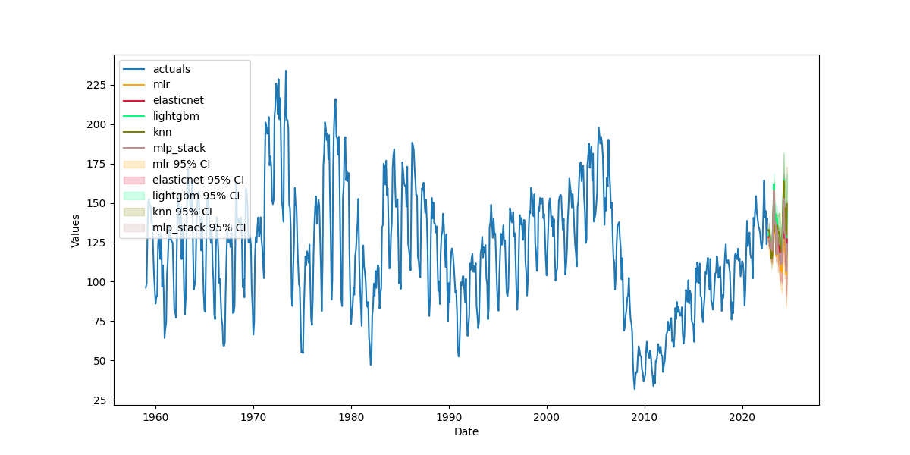

# Scalecast

<p align="center">
  
</p>

## About

Scalecast is a light-weight time-series forecasting procedure, wrapper, and results container built by and for applied Data Scientists using an ML framework. It offers a streamlined transforming, tuning, reverting, and reporting interface with many model classes, from basic ARIMA and linear models to boosted trees and recurrent neural nets. No matter which models you want to play with, the uniform interface makes it easy and fun to get results quickly.

All forecasts are validated out-of-sample, usually with a dynamic recursive approach (RNNs use a direct point estimate). You won't ever run into the situation where the estimator looks great on the test-set but can't generalize to real data. What you see is what you get, with no attempt to oversell results. If you run a model that's able to predict the COVID pandemic in your test-set, you probably have a one-step forecast happening under-the-hood, which is easy to fall into, especially for those not specialized in time series. You can't predict the unpredictable, and you won't see such things with scalecast.  

## Starter Code

```python
from scalecast.Forecaster import Forecaster
from scalecast.Pipeline import Pipeline, Transformer, Reverter
from scalecast.auxmodels import mlp_stack
from scalecast import GridGenerator
import matplotlib.pyplot as plt
import pandas_datareader as pdr

models = (
  'mlr',
  'elasticnet',
  'lightgbm',
  'knn',
)

GridGenerator.get_example_grids()

df = pdr.get_data_fred(
  'HOUSTNSA',
  start='1959-01-01',
  end='2022-08-01'
)

f = Forecaster(
  y=df['HOUSTNSA'],
  current_dates=df.index,
  future_dates=24,
)
f.set_test_length(.2)
f.set_validation_length(24)

def forecaster(f,models):
    """ add Xvars and forecast
    """
    f.add_covid19_regressor()
    f.auto_Xvar_select()
    f.tune_test_forecast(
        models,
        dynamic_testing=24, # test-set metrics will be an average of rolling 24-step forecasts
        cross_validate=True,
        k = 3,
    )
    mlp_stack(f,models)
        
transformer = Transformer(
    transformers = [
        ('DiffTransform',1),
        ('DiffTransform',12),
    ],
)
reverter = Reverter(
    # list reverters in reverse order
    reverters = [
        ('DiffRevert',12),
        ('DiffRevert',1),
    ],
    base_transformer = transformer,
)
pipeline = Pipeline(
    steps = [
        ('Transform',transformer),
        ('Forecast',forecaster),
        ('Revert',reverter),
    ],
)

f = pipeline.fit_predict(f,models=models)

f.reeval_cis() # expanding cis based on all model results
f.plot(ci=True,order_by='LevelTestSetMAPE')
plt.show()

results = f.export(
  ['model_summaries','lvl_fcsts']
)
```


## Models
The library provides the [`Forecaster`](https://scalecast.readthedocs.io/en/latest/Forecaster/Forecaster.html) (for one series) and [`MVForecaster`](https://scalecast.readthedocs.io/en/latest/Forecaster/MVForecaster.html) (for multiple series) wrappers around the following estimators: 

- [Scikit-Learn](https://scalecast.readthedocs.io/en/latest/Forecaster/_forecast.html#sklearn)
  - [ElasticNet](https://scikit-learn.org/stable/modules/generated/sklearn.linear_model.ElasticNet.html)
  - [Gradient Boosted Trees](https://scikit-learn.org/stable/modules/generated/sklearn.ensemble.GradientBoostingRegressor.html)
  - [k-Nearest Neighbors](https://scikit-learn.org/stable/modules/generated/sklearn.neighbors.KNeighborsRegressor.html)
  - [Lasso](https://scikit-learn.org/stable/modules/generated/sklearn.linear_model.Lasso.html)
  - [Multi-level Perceptron](https://scikit-learn.org/stable/modules/generated/sklearn.neural_network.MLPRegressor.html)
  - [Multiple Linear Regression](https://scikit-learn.org/stable/modules/generated/sklearn.linear_model.LinearRegression.html)
  - [Random Forest](https://scikit-learn.org/stable/modules/generated/sklearn.ensemble.RandomForestRegressor.html)
  - [Ridge](https://scikit-learn.org/stable/modules/generated/sklearn.linear_model.Ridge.html)
  - [Stochastic Gradient Descent](https://scikit-learn.org/stable/modules/generated/sklearn.linear_model.SGDRegressor.html)
  - [Support Vector Machine](https://scikit-learn.org/stable/modules/generated/sklearn.svm.SVR.html)
  - [Any other sklearn regression model or regression model that uses an sklearn interface can be ported](https://scalecast.readthedocs.io/en/latest/Forecaster/Forecaster.html#src.scalecast.Forecaster.Forecaster.add_sklearn_estimator)
- [XGBoost](https://xgboost.readthedocs.io/en/stable/parameter.html)
- [LightGBM](https://lightgbm.readthedocs.io/en/latest/pythonapi/lightgbm.LGBMRegressor.html#lightgbm.LGBMRegressor)

The `Forecaster` object only can use:

- [StatsModels](https://www.statsmodels.org/stable/)
  - [ARIMA](https://scalecast.readthedocs.io/en/latest/Forecaster/_forecast.html#module-src.scalecast.Forecaster.Forecaster._forecast_arima)
  - [Holt-Winters Exponential Smoothing](https://scalecast.readthedocs.io/en/latest/Forecaster/_forecast.html#module-src.scalecast.Forecaster.Forecaster._forecast_hwes)
- [Darts](https://unit8co.github.io/darts/)
  - [Four Theta](https://scalecast.readthedocs.io/en/latest/Forecaster/_forecast.html#module-src.scalecast.Forecaster.Forecaster._forecast_theta)
- [Keras TensorFlow Cells](https://keras.io/)
  - [LSTM](https://www.tensorflow.org/api_docs/python/tf/keras/layers/LSTM)
  - [SimpleRNN](https://www.tensorflow.org/api_docs/python/tf/keras/layers/SimpleRNN)
  - [Dense](https://www.tensorflow.org/api_docs/python/tf/keras/layers/Dense)
- [Facebook Prophet](https://facebook.github.io/prophet)
- [LinkedIn Greykite](https://engineering.linkedin.com/blog/2021/greykite--a-flexible--intuitive--and-fast-forecasting-library)
  - [silverkite](https://linkedin.github.io/greykite/docs/0.1.0/html/pages/model_components/0100_introduction.html)
- [Native Combo model](https://scalecast.readthedocs.io/en/latest/Forecaster/_forecast.html#module-src.scalecast.Forecaster.Forecaster._forecast_combo)

The `MVForecaster` object only can use:
- [StatsModels](https://www.statsmodels.org/stable/)
  - [VECM](https://scalecast.readthedocs.io/en/latest/Forecaster/Auxmodels.html#vecm)

Want more models? Open a [feature request](https://github.com/mikekeith52/scalecast/issues/new)!  

The library interfaces nicely with interactive notebook applications.

<p align="center">
  
</p>

## Features
- Model Validation
  - [Grid search on validation data](https://scalecast.readthedocs.io/en/latest/Forecaster/Forecaster.html#src.scalecast.Forecaster.Forecaster.tune)
  - [Grid search using time series cross validation](https://scalecast.readthedocs.io/en/latest/Forecaster/Forecaster.html#src.scalecast.Forecaster.Forecaster.cross_validate)
  - [Backtest](https://scalecast.readthedocs.io/en/latest/Forecaster/Forecaster.html#src.scalecast.Forecaster.Forecaster.backtest)
- [Probabilistic Forecasting](https://scalecast.readthedocs.io/en/latest/Forecaster/Forecaster.html#src.scalecast.Forecaster.Forecaster.proba_forecast) and [other confidence interval types](https://scalecast-examples.readthedocs.io/en/latest/misc/cis/cis.html) (future: [awesome conformal prediction](https://github.com/valeman/awesome-conformal-prediction))
- Model input analysis
  - [Feature importance scoring](https://scalecast.readthedocs.io/en/latest/Forecaster/Forecaster.html#src.scalecast.Forecaster.Forecaster.save_feature_importance)
    - [SHAP](https://shap.readthedocs.io/en/latest/index.html)
    - [Permutated feature scoring with ELI5](https://eli5.readthedocs.io/en/latest/index.html)
  - [Summary stats for descriptive models](https://scalecast.readthedocs.io/en/latest/Forecaster/Forecaster.html#src.scalecast.Forecaster.Forecaster.save_summary_stats)
  - [Auto Feature Selection](https://scalecast.readthedocs.io/en/latest/Forecaster/Forecaster.html#src.scalecast.Forecaster.Forecaster.auto_Xvar_select)
  - [Feature reduction](https://scalecast.readthedocs.io/en/latest/Forecaster/Forecaster.html#src.scalecast.Forecaster.Forecaster.reduce_Xvars)
- [Anomaly detection](https://scalecast.readthedocs.io/en/latest/Forecaster/AnomalyDetector.html)
- [Changepoint detection](https://scalecast.readthedocs.io/en/latest/Forecaster/ChangepointDetector.html)
- [Series transformation/revert functions](https://scalecast.readthedocs.io/en/latest/Forecaster/SeriesTransformer.html)

## Installation
- Only the base package is needed to get started:  
  - `pip install --upgrade scalecast`  
- Optional add-ons:  
  - `pip install darts`  
  - `pip install prophet`  
  - `pip install greykite`  
  - `pip install shap` (SHAP feature importance)  
  - `pip install kats` (changepoint detection)  
  - `pip install pmdarima` (auto arima)  
  - `pip install tqdm` (progress bar for notebook)  
  - `pip install ipython` (widgets for notebook)  
  - `pip install ipywidgets` (widgets for notebook)  
  - `jupyter nbextension enable --py widgetsnbextension` (widgets for notebook)  
  - `jupyter labextension install @jupyter-widgets/jupyterlab-manager` (widgets for Lab)  

## Links
### Official Docs
  - [Read the Docs](https://scalecast.readthedocs.io/en/latest/)
  - [Introductory Notebook](https://scalecast-examples.readthedocs.io/en/latest/misc/introduction/Introduction2.html)
  - [Introductory Blog Post](https://towardsdatascience.com/introducing-scalecast-a-forecasting-library-pt-1-33b556d9b019)
  - [Examples Repository](https://github.com/mikekeith52/scalecast-examples)
  - [Change Log](https://scalecast.readthedocs.io/en/latest/change_log.html)

### [Forecasting with Different Model Types](https://scalecast.readthedocs.io/en/latest/Forecaster/_forecast.html)
- Sklearn Univariate
  - [Expand your Time Series Arsenal with These Models](https://towardsdatascience.com/expand-your-time-series-arsenal-with-these-models-10c807d37558)
  - [Notebook](https://scalecast-examples.readthedocs.io/en/latest/sklearn/sklearn.html)
- Sklearn Multivariate
  - [Multiple Series? Forecast Them together with any Sklearn Model](https://towardsdatascience.com/multiple-series-forecast-them-together-with-any-sklearn-model-96319d46269)
  - [Notebook](https://scalecast-examples.readthedocs.io/en/latest/multivariate/multivariate.html)
- RNN 
  - [Exploring the LSTM Neural Network Model for Time Series](https://towardsdatascience.com/exploring-the-lstm-neural-network-model-for-time-series-8b7685aa8cf)
  - [LSTM Notebook](https://scalecast-examples.readthedocs.io/en/latest/lstm/lstm.html)
  - [RNN Notebook](https://scalecast-examples.readthedocs.io/en/latest/rnn/rnn.html)
- ARIMA
  - [Forecast with ARIMA in Python More Easily with Scalecast](https://towardsdatascience.com/forecast-with-arima-in-python-more-easily-with-scalecast-35125fc7dc2e)
  - [Notebook](https://scalecast-examples.readthedocs.io/en/latest/arima/arima.html)
- Theta
  - [Easily Employ A Theta Model For Time Series](https://medium.com/towards-data-science/easily-employ-a-theta-model-for-time-series-b94465099a00)
  - [Notebook](https://scalecast-examples.readthedocs.io/en/latest/theta/theta.html)
- VECM
  - [Employ a VECM to predict FANG Stocks with an ML Framework](https://medium.com/p/52f170ec68e6)
  - [Notebook](https://scalecast-examples.readthedocs.io/en/latest/vecm/vecm.html)
- Other Notebooks
  - [Prophet](https://scalecast-examples.readthedocs.io/en/latest/prophet/prophet.html)
  - [Combo](https://scalecast-examples.readthedocs.io/en/latest/combo/combo.html)
  - [Holt-Winters Exponential Smoothing](https://scalecast-examples.readthedocs.io/en/latest/hwes/hwes.html)
  - [Silverkite](https://scalecast-examples.readthedocs.io/en/latest/silverkite/silverkite.html)
  - [Confidence Intervals](https://scalecast-examples.readthedocs.io/en/latest/misc/cis/cis.html)  
  
### The importance of dynamic validation
- [How Not to be Fooled by Time Series Models](https://towardsdatascience.com/how-not-to-be-fooled-by-time-series-forecasting-8044f5838de3)
- [Model Validation Techniques for Time Series](https://towardsdatascience.com/model-validation-techniques-for-time-series-3518269bd5b3)
- [Notebook](https://scalecast-examples.readthedocs.io/en/latest/misc/validation/validation.html)

### Model Input Selection
- [Variable Reduction Techniques for Time Series](https://medium.com/towards-data-science/variable-reduction-techniques-for-time-series-646743f726d4)
- [Auto Model Specification with ML Techniques for Time Series](https://mikekeith52.medium.com/auto-model-specification-with-ml-techniques-for-time-series-e7b9a90ae9d7)
- [Notebook 1](https://scalecast-examples.readthedocs.io/en/latest/misc/feature-selection/feature_selection.html)
- [Notebook 2](https://scalecast-examples.readthedocs.io/en/latest/misc/auto_Xvar/auto_Xvar.html)

### Scaled Forecasting on Many Series
- [M4 Notebook](https://github.com/mikekeith52/scalecast-examples/tree/main/m4)  
- [May the Forecasts Be with You](https://towardsdatascience.com/may-the-forecasts-be-with-you-introducing-scalecast-pt-2-692f3f7f0be5)
- [Introductory Notebook Section](https://scalecast-examples.readthedocs.io/en/latest/misc/introduction/Introduction2.html#Scaled-Automated-Forecasting)

### Anomaly Detection
- [Anomaly Detection for Time Series with Monte Carlo Simulations](https://towardsdatascience.com/anomaly-detection-for-time-series-with-monte-carlo-simulations-e43c77ba53c?source=email-85177a9cbd35-1658325190052-activity.collection_post_approved)
- [Notebook1](https://scalecast-examples.readthedocs.io/en/latest/misc/anomalies/anomalies.html)
- [Notebook2](https://github.com/mikekeith52/scalecast-examples/blob/main/misc/anomalies/monte%20carlo/monte%20carlo.ipynb)

## See Contributing
- [Contributing.md](https://github.com/mikekeith52/scalecast/blob/main/Contributing.md)