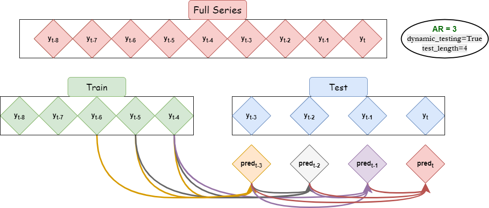
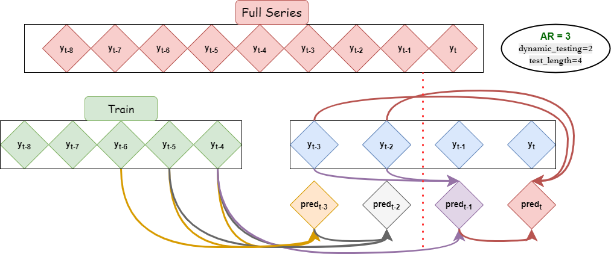

.. scalecast documentation master file, created by
   sphinx-quickstart on Fri Jan 21 15:40:54 2022.
   You can adapt this file completely to your liking, but it should at least
   contain the root `toctree` directive.

Scalecast Official Docs
==========================

**The pratictioner's forecasting library.** Including automated model selection, model optimization, pipelines, visualization, and reporting.

.. code:: console

   $ pip install --upgrade scalecast

.. image:: https://media2.giphy.com/media/vV2Mbr9v6pH1D8hiLb/giphy.gif?cid=790b7611eb56b43191020435cbedf6453a74ddc2cebd017d&rid=giphy.gif&ct=g
 :target: https://scalecast-examples.readthedocs.io/en/latest/misc/introduction/Introduction2.html#Scaled-Automated-Forecasting

Forecasting with Python has never been easier.

.. code:: python
   
   import pandas as pd
   from scalecast.Forecaster import Forecaster
   from scalecast import GridGenerator

   GridGenerator.get_example_grids()

   data = pd.read_csv('data.csv')
   f = Forecaster(
      y = data['values'],
      current_dates = data['date'],
      future_dates = 24, # forecast horizon
      test_length = 0, # set a test set length or fraction to validate all models if desired
      cis = False, # choose whether or not to evaluate confidence intervals for all models
   )
   f.set_estimator('xgboost')

   f.auto_Xvar_select() # find best look-back, trend, and seasonality for your series
   f.cross_validate(k=3) # tune model hyperparams using time series cross validation
   f.auto_forecast() # automatically forecast with the chosen Xvars and hyperparams

   results = f.export(['lvl_fcsts','model_summaries']) # extract results

Dynamic Recursive Forecasting
--------------------------------

Scalecast allows you to use a series' lags (autoregressive, or AR, terms) as inputs by employing a dynamic recursive forecasting method to generate predictions and validate all models out-of-sample.

Dynamic Recursive Forecasting with Peeking
------------------------------------------------------------

The recursive process can be tweaked to allow the model to "peek" at real values during the testing phase. You can choose after how many steps the model is allowed to do this by specifying `dynamic_testing=<int>`. The advantage here is that you can report your test-set metrics as an average of rolling smaller-step forecasts to glean a better idea about how well your algorithm can predict over a specific forecast horizon. You can also select models that are optimized on a given forecast horizon.

`dynamic_testing=True` is the default and `dynamic_testing=1` or `dynamic_testing=False` means the test-set metrics are averages of one-step forecasts.

Links
---------

`Readme <about.rst>`_
   Overview, starter code, and installation.

`Introductory Notebook <https://scalecast-examples.readthedocs.io/en/latest/misc/introduction/Introduction2.html>`_
   A well-organized notebook that will quickly show you a lot of cool features.

`Examples <https://scalecast-examples.readthedocs.io/en/latest/index.html>`_
   Other example notebooks.

:doc:`Forecaster/ForecasterGlobals`
   Key terms that will make your life easier when reading documentation.

:doc:`Forecaster/_forecast`
   What models are available?

:doc:`change_log`
   Recent additions and bug fixes.

.. image:: https://img.shields.io/badge/python-3.7+-blue.svg
 :target: https://pepy.tech/project/scalecast
.. image:: https://static.pepy.tech/personalized-badge/scalecast?period=total&units=international_system&left_color=black&right_color=brightgreen&left_text=Downloads
 :target: https://pepy.tech/project/scalecast
.. image:: https://img.shields.io/badge/code%20style-black-black
 :target: https://github.com/psf/black
.. image:: https://readthedocs.org/projects/scalecast/badge/?version=latest
 :target: https://scalecast.readthedocs.io/en/latest/?badge=latest
 :alt: Documentation Status

Index
------
* :ref:`genindex`

.. Hidden TOCs

.. toctree::
   :maxdepth: 4
   :caption: High Level:
   :hidden:

   about
   Forecaster/ForecasterGlobals
   Forecaster/_forecast

.. toctree::
   :maxdepth: 4
   :caption: Classes:
   :hidden:

   Forecaster/Forecaster
   Forecaster/MVForecaster
   Forecaster/Pipeline
   Forecaster/SeriesTransformer
   Forecaster/AnomalyDetector
   Forecaster/ChangepointDetector

.. toctree::
   :maxdepth: 4
   :caption: Modules:
   :hidden:

   Forecaster/GridGenerator
   Forecaster/Auxmodels
   Forecaster/Multiseries
   Forecaster/Notebook
   Forecaster/Util

.. toctree::
   :maxdepth: 4
   :caption: Examples:
   :hidden: 

   https://scalecast-examples.readthedocs.io/en/latest/

.. toctree::
   :maxdepth: 1
   :caption: ChangeLog:  
   :hidden:

   change_log
